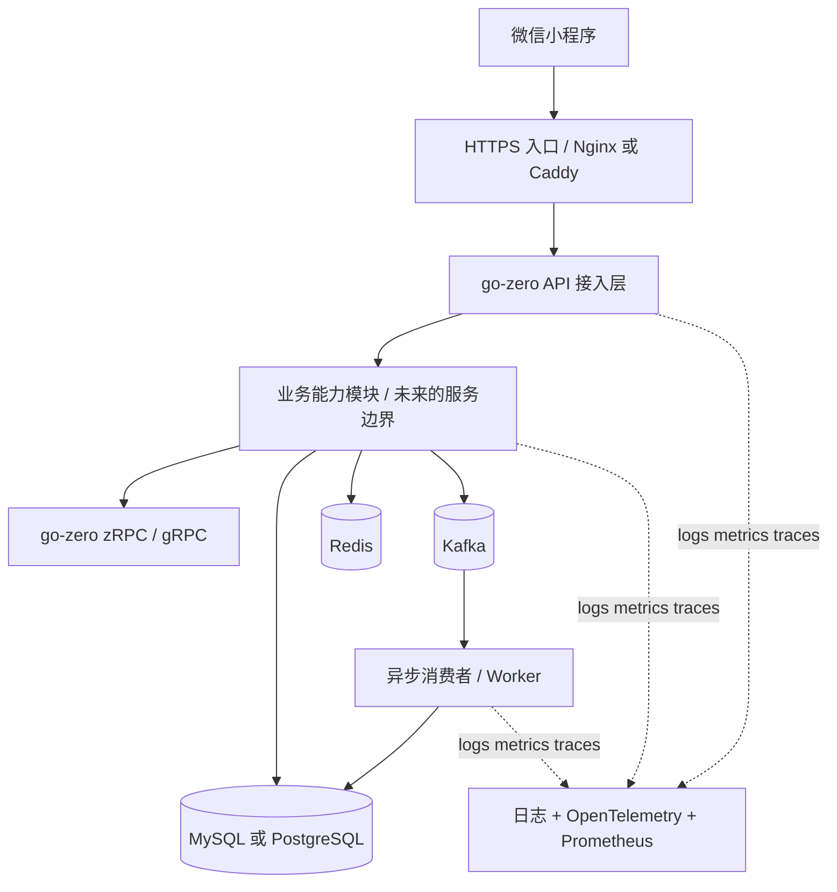

# Hospital 总体技术规划

> 文档状态：初稿，用于确定技术方向，不作为最终服务拆分方案
>
> 更新时间：2026-08-09
>
> 产品形态：微信小程序 + Go 微服务后端
>
> 核心框架：go-zero

## 1. 规划目的

Hospital 建设为面向微信小程序用户的医院检查业务平台，后端负责身份认证、业务数据、规则或方案计算、状态记录与异步处理。

当前文档只解决四个问题：

1. 确定系统技术基线、基础设施边界和交付标准。
2. 明确已确定的技术选型以及按条件引入的扩展组件。
3. 在服务边界尚未最终确定时，保持仓库、契约和数据归属可扩展。
4. 控制架构复杂度，确保可靠性、交付效率和长期维护成本处于可接受范围。

本阶段不预设具体微服务数量、名称和数据库表。服务边界将在业务流程、数据归属、发布节奏和非功能需求明确后单独设计。

## 2. 已确认的总体方向

| 领域 | 当前决定 | 说明 |
|---|---|---|
| 客户端 | 微信小程序优先 | 面向移动端用户，不把 PC Web 作为首期必需项 |
| 后端语言 | Go | 与 go-zero 生态统一 |
| 微服务框架 | go-zero | 用于 HTTP API、RPC、治理能力和代码生成 |
| 缓存 | Redis | 缓存、限流、幂等和短期状态，不作为业务事实库 |
| 关系数据库 | MySQL 8.4 | 作为首期业务事实库；变更选型需要单独技术决策记录 |
| 消息系统 | Kafka | 用于异步事件、削峰、解耦和最终一致性 |
| 部署 | Docker | Compose 用于本地与集成环境，生产环境按容量和可用性要求部署 |
| 仓库模式 | Monorepo | 一个仓库管理小程序、服务、契约、部署和文档 |

## 3. 对 go-zero 的正确定位

go-zero 不只是一个 HTTP 路由框架。它可以覆盖微服务项目中的多类基础能力：

- 使用 `.api` 文件描述 HTTP 路由和请求响应结构，通过 `goctl` 生成 API 服务骨架；
- 使用 `.proto` 描述内部 RPC 契约，通过 `goctl` 生成 zRPC/gRPC 服务端和客户端；
- 使用 `ServiceContext` 在服务启动时集中构造数据库、Redis、Kafka 和 RPC 客户端；
- 提供超时、限流、熔断、负载均衡、日志、指标和链路追踪等服务治理能力；
- 可通过 etcd、静态地址或 Kubernetes DNS 完成服务发现；
- 可生成 Model、Dockerfile、Kubernetes 清单等工程代码。

官方生成的 API 服务主要遵循以下调用链：

```text
HTTP Request
    -> Handler：解析请求并调用 Logic
    -> Logic：实现一个具体用例
    -> Model / RPC Client：访问数据或调用其他服务
    -> HTTP Response
```

需要遵守的边界：

- `handler` 保持很薄，不写数据库操作和复杂业务逻辑；
- `logic` 负责用例编排，是主要业务代码所在位置；
- `model` 只负责数据访问；
- `svc.ServiceContext` 只管理共享依赖，不承载业务逻辑；
- `.api` 和 `.proto` 是契约源文件，生成代码不手工修改。

参考资料：

- [go-zero 项目结构](https://go-zero.dev/concepts/project-structure/)
- [goctl API 代码生成](https://go-zero.dev/reference/cli-guide/api/)
- [goctl CLI](https://go-zero.dev/reference/cli-guide/)

## 4. 总体逻辑架构

在服务边界尚未确定时，先按层次表达，不提前画出若干具体微服务：



这里的“API 接入层”不一定需要单独做一个复杂网关。首期可以由一个面向小程序的 go-zero API 服务承担接口聚合，Nginx 或 Caddy 只负责 TLS、域名和反向代理。等服务数量和流量真的增加后，再决定是否建设独立 API Gateway。

## 5. 推荐技术栈

### 5.1 必选技术

| 能力 | 推荐选型 | 使用边界 |
|---|---|---|
| HTTP API | go-zero REST | 对微信小程序暴露 HTTPS/JSON API |
| 内部通信 | go-zero zRPC + Protobuf | 只用于必须同步得到结果的跨服务调用 |
| 代码生成 | goctl | 生成 API、RPC、Model 和 Dockerfile |
| 关系数据库 | MySQL 8 或 PostgreSQL | 保存用户、订单/方案、规则、状态等业务事实 |
| 缓存 | Redis | 缓存、限流、幂等键、验证码和短期会话状态 |
| 消息队列 | Kafka | 业务事件、异步任务和跨服务状态传播 |
| 容器 | Docker | 每个可部署单元构建独立镜像 |
| 本地编排 | Docker Compose | 启动后端、数据库、Redis、Kafka 等依赖 |
| 接口契约 | `.api` + `.proto` | 契约优先，生成代码进入版本控制 |
| 数据迁移 | Goose、Atlas 或 golang-migrate 三选一 | 数据库结构变更必须版本化，禁止只依赖自动建表 |

### 5.2 建议补齐的工程能力

| 能力 | 推荐方向 | 为什么需要 |
|---|---|---|
| 服务发现 | etcd；本地可先用静态地址 | 多实例和 RPC 服务发现；本地开发不必强制引入 |
| 入口代理 | Nginx 或 Caddy | HTTPS、域名、请求体限制和反向代理 |
| 认证 | 微信 `code2Session` + 自有 Token | 小程序不直接把微信会话当成后端业务会话 |
| 权限 | RBAC 或最小角色模型 | 区分普通用户、管理员及资源所有权 |
| 日志 | go-zero 日志 + JSON 结构化字段 | 统一记录 `request_id`、`trace_id` 和业务标识 |
| 链路追踪 | OpenTelemetry | 排查 API、RPC、数据库、Kafka 的跨组件问题 |
| 指标 | Prometheus + Grafana | 观察延迟、错误率、缓存命中率和 Kafka 积压 |
| API 文档 | 由 `.api` 生成 OpenAPI/Swagger | 便于小程序联调和接口验收 |
| 测试 | Go testing + Testcontainers | 单元测试之外验证真实 Redis、数据库和 Kafka |
| CI/CD | GitHub Actions 或其他流水线 | 自动执行格式检查、测试、构建和镜像扫描 |
| 密钥管理 | 环境变量或部署平台 Secret | 微信 AppSecret、数据库密码不得写入仓库 |

### 5.3 暂缓引入

以下技术不纳入首期基线，仅在业务规模、查询模式或运维要求明确后引入：

- Kubernetes：Docker Compose 能完成首期部署后，再考虑迁移；
- 两种关系数据库同时使用：先选 MySQL 或 PostgreSQL 中的一种；
- Elasticsearch、Neo4j、MinIO：只有明确出现全文检索、图遍历或对象存储需求时再增加；
- 分布式事务框架：优先使用本地事务、Outbox 和幂等消费者；
- 独立配置中心、权限中心和网关服务：业务复杂度达到需要时再拆；
- 多套前端：首期只维护微信小程序。

## 6. 关系数据库选型

首期基线确定为 MySQL 8.4，负责保存用户、业务方案、状态、规则、审计和 Outbox 等业务事实。数据库结构通过迁移文件管理，禁止由运行时自动建表替代版本化迁移。

### 采用 MySQL 的依据

- 可直接使用 goctl 的 MySQL Model 生成能力；
- 部署、备份和监控体系成熟；
- 业务以常规事务和 CRUD 为主。

### 重新评估 PostgreSQL 的条件

- 更重视复杂查询、JSONB、数组、窗口函数或更严格的数据约束；
- 后续业务可能需要更强的 SQL 表达能力；
- 现有 MySQL 方案在查询表达、约束或性能上形成可验证的瓶颈。

如需变更为 PostgreSQL，应通过架构决策记录说明迁移成本、驱动兼容性、数据迁移和回滚方案。没有明确收益时，不同时维护两种关系数据库。

## 7. Redis 的使用范围

Redis 建议承担：

- 高频但可重建数据的缓存；
- 微信登录临时态、刷新令牌撤销状态或短期会话辅助信息；
- 接口限流；
- 重复提交防护和幂等键；
- 短期分布式锁，但必须设置过期时间并考虑误释放；
- 热点数据和短生命周期计算结果。

Redis 不应承担：

- 唯一的用户、方案或业务状态存储；
- 无过期时间、无法重建的重要业务数据；
- 用一个大 Key 保存整个业务对象集合；
- 缺少命名、版本和过期策略的随意缓存。

推荐 Key 规范：

```text
hospital:{environment}:{domain}:{purpose}:{id}:{version}
```

## 8. Kafka 的接入原则

go-zero 提供基于 Kafka 的 `kq` 消费能力，也可以直接使用 Kafka Go 客户端。Kafka 适合处理：

- 某项业务完成后触发的通知、审计和统计；
- 跨服务状态同步；
- 耗时任务异步执行；
- 流量削峰；
- 可重放的领域事件。

Kafka 不应替代同步查询。用户点击后必须立刻得到的查询结果，优先通过 API、RPC 和数据库完成。

推荐事件信封：

```json
{
  "event_id": "全局唯一 ID",
  "event_type": "domain.entity.action.v1",
  "occurred_at": "UTC 时间",
  "producer": "服务名称",
  "trace_id": "链路 ID",
  "aggregate_id": "业务聚合 ID",
  "schema_version": 1,
  "payload": {}
}
```

必须提前设计：

- Topic 命名、分区 Key 和消息 Schema 版本；
- 至少一次投递下的消费者幂等；
- 重试次数、退避策略、死信 Topic 和告警；
- 消费积压监控；
- 数据库写入和 Kafka 发布之间的一致性。

对于“先写数据库，再发 Kafka”的场景，推荐使用 Outbox：在同一个数据库事务中写业务数据与事件记录，再由后台发布器将事件可靠投递到 Kafka。消费者使用 `event_id` 或业务幂等键去重，避免双写不一致。

参考资料：[go-zero Kafka/kq](https://go-zero.dev/components/queue/kafka/)

## 9. 微信小程序端规划

### 9.1 首期建议

首期明确以微信小程序为唯一用户端：

- 使用 TypeScript；
- 按页面、组件、API Client、状态管理和工具包分层；
- 所有业务数据通过 HTTPS API 获取；
- 微信临时登录 `code` 只传给后端换取业务 Token；
- AppSecret 只能保存在服务端；
- 不在本地存储不必要的医疗或身份敏感数据；
- API Client 统一注入 Token、`request_id` 和错误处理。

### 9.2 原生小程序还是跨端框架

- 只确定微信小程序：优先原生小程序 + TypeScript，依赖少、微信能力接入直接；
- 明确在较短时间内还要发布独立 App：再评估 Taro、uni-app 或独立 Flutter/原生客户端；
- 不建议为了未来“可能有 App”而在首版同时维护多端代码。

后端 API 不依赖小程序页面结构。只要接口契约、认证和版本控制保持稳定，未来的独立 App 可以复用同一套后端。

## 10. 可扩展的单仓库结构

服务边界尚未确定时，仓库使用占位式结构，不预先创建一批空服务：

```text
Hospital/
├── apps/
│   └── miniapp/                    # 微信小程序
├── service/
│   └── <business-domain>/          # 业务边界确定后创建
│       ├── api/                    # 对外 HTTP API，可选
│       ├── rpc/                    # 内部 zRPC，可选
│       └── consumer/               # Kafka 消费者，可选
├── common/
│   ├── auth/                       # 通用认证基础能力
│   ├── errors/                     # 统一错误码和错误响应
│   ├── middleware/                 # 跨服务 HTTP 中间件
│   ├── observability/              # 日志、指标、追踪
│   └── event/                      # 事件信封和通用消息能力
├── contracts/
│   ├── api/                        # go-zero .api 源文件
│   ├── proto/                      # Protobuf 契约
│   └── events/                     # Kafka 事件 Schema
├── migrations/
│   └── <business-domain>/          # 按数据归属管理迁移
├── deploy/
│   ├── compose/                    # Docker Compose
│   ├── docker/                     # Dockerfile 或模板
│   ├── proxy/                      # Nginx/Caddy 配置
│   └── observability/              # Prometheus/Grafana/OTel 配置
├── tests/
│   ├── integration/
│   └── contract/
├── scripts/                        # 代码生成、迁移和开发脚本
├── plan/                           # 规划文档
├── go.mod
└── README.md
```

业务边界确定后，一个典型 go-zero API 目录会进一步生成：

```text
api/
├── etc/
├── internal/
│   ├── config/
│   ├── handler/
│   ├── logic/
│   ├── svc/
│   └── types/
└── <name>.go
```

组织约束：

1. 服务可以共享 `common` 中的技术基础代码，但不能引用其他服务的 `internal` 业务代码。
2. 每份业务数据只能有一个明确的拥有者，其他服务通过 API、RPC 或事件访问。
3. 不把所有工具函数都塞进 `common`；只有两个以上服务稳定复用的技术能力才上移。
4. API、Proto 和事件 Schema 均需要版本控制和兼容性检查。
5. 单仓库不等于共用一个数据库，也不等于可以跨服务直接查询对方数据表。

## 11. 服务拆分的判断标准

后续划分微服务时，应同时考虑：

- 是否拥有独立、清晰的业务能力；
- 是否拥有可以独立管理的数据；
- 是否有不同的扩缩容、可靠性或安全要求；
- 是否需要独立发布；
- 是否能通过稳定契约与其他能力交互。

不应只因为“功能名称不同”就拆服务。以下情况通常先保留在同一个服务中：

- 只能一起完成、一起发布的功能；
- 共享同一事务且暂时无法形成稳定边界的数据；
- 仅有几张 CRUD 表、没有独立业务规则的模块；
- 单人开发时拆分成本明显高于收益的能力。

建议先实现一个端到端业务闭环，再根据实际耦合点拆分，而不是第一天创建十几个进程。

## 12. 配置、服务发现和环境

建议至少区分：

```text
local        本地开发
test         自动化测试
staging      预发布验证
production   正式环境
```

配置原则：

- YAML 保存非敏感配置结构；
- 密码、微信 AppSecret、JWT 密钥通过环境变量或 Secret 注入；
- 配置中不使用 `localhost` 指代 Docker 容器间服务；
- 超时、重试、RPC 地址、Kafka Brokers 等必须可配置；
- 仓库提供 `.env.example`，但不提交真实 `.env`；
- 本地和 CI 可以使用静态 RPC Endpoint；需要多实例发现时再使用 etcd。

go-zero 支持 etcd、静态 Endpoints 和 Kubernetes DNS 等服务发现方式。本地开发不必为了形式强制依赖 etcd；当出现多个 RPC 服务或多实例部署时再启用。参考：[go-zero 服务发现](https://go-zero.dev/guides/microservice/service-discovery/)

## 13. 安全与隐私基线

医院相关应用涉及身份和健康相关信息，必须按敏感数据项目设计：

1. 外部接口只通过 HTTPS 暴露。
2. 小程序端不保存 AppSecret、数据库凭据或内部服务地址。
3. Access Token 短期有效，Refresh Token 可撤销并支持轮换。
4. 每个用户资源接口都校验资源所有权，不能只校验“已登录”。
5. 日志不记录 Token、微信临时 code、密码和完整敏感资料。
6. 数据库、Redis、Kafka、etcd 不直接暴露公网。
7. 管理操作、规则变更和敏感数据访问保留审计记录。
8. 输入参数、文件上传、请求体大小和接口频率均应限制。
9. 数据采集遵循最小必要原则；测试与预发布环境使用脱敏数据或明确标注的模拟数据。
10. 小程序公开上线前单独确认微信服务类目、隐私指引、备案和医疗相关资质要求。

## 14. 可观测性设计

微服务项目必须能回答“哪个请求在什么环节失败”：

- 日志：结构化 JSON，包含服务名、环境、`request_id`、`trace_id`、用户匿名标识和错误码；
- 指标：请求量、P95/P99 延迟、错误率、RPC 超时、数据库连接池、Redis 命中率、Kafka 消费积压；
- 链路：小程序请求进入后，Trace 上下文需要跨 API、RPC 和 Kafka 传播；
- 告警：服务不可用、错误率异常、Kafka 积压、数据库连接耗尽和磁盘空间不足；
- 健康检查：区分进程存活和依赖就绪。

首期可先完成结构化日志和健康检查，再接 OpenTelemetry、Prometheus、Grafana。不要等故障出现后才补可观测性字段。

## 15. 测试策略

| 层级 | 重点 |
|---|---|
| 单元测试 | Logic 中的业务规则、校验、状态转换和幂等判断 |
| Model 测试 | SQL、事务、索引和数据约束 |
| API 测试 | 参数校验、错误码、认证、资源所有权 |
| RPC 契约测试 | Proto 兼容性、超时和错误映射 |
| 消息测试 | 事件序列化、重复消费、乱序、重试和死信 |
| 集成测试 | 使用真实数据库、Redis、Kafka 跑完整链路 |
| 小程序联调 | 登录、Token 刷新、弱网、重复点击和错误提示 |

最低 CI 检查：

```text
gofmt / gofmt check
go vet
go test ./...
go build ./...
契约格式检查
数据库迁移校验
Docker 镜像构建
依赖和镜像安全扫描
```

## 16. 实施与交付路线

### 阶段 A：建立工程基线

1. 固定 Go、go-zero、goctl 和 protoc 版本，并纳入环境检查。
2. 建立契约优先的 API 代码生成流程和生成文件管理规范。
3. 建立统一配置、错误码、结构化日志、请求 ID 和健康检查。
4. 使用 Docker Compose 提供可重复的本地与集成环境。
5. 在 CI 中执行契约校验、测试、构建和依赖安全检查。

### 阶段 B：交付首条核心业务链路

1. 选择 MVP 中优先级最高且可以独立验收的业务用例。
2. 定义 `.api` 请求与响应。
3. 在 Logic 中实现业务规则、权限和错误映射。
4. 使用 MySQL 迁移文件、事务和索引完成数据持久化。
5. 仅在存在缓存、限流或幂等需求时接入 Redis。
6. 补齐单元测试、API 测试和数据库集成测试。
7. 建立小程序到后端的端到端验收流程。

### 阶段 C：演进服务架构

1. 根据业务能力、数据归属、发布节奏和扩缩容要求确认服务边界。
2. 用 `.proto` 定义同步 RPC 契约。
3. 本地和 CI 使用静态 Endpoint，生产多实例场景使用 etcd 或部署平台服务发现。
4. 配置超时、熔断、错误映射和链路追踪。
5. 通过故障测试验证下游超时、不可用和恢复时的系统行为。

### 阶段 D：建设事件驱动链路

1. 选择一个具有明确生产者、消费者和异步价值的领域事件。
2. 定义事件 Schema、Topic、分区 Key 和消费者组。
3. 实现幂等消费者、重试和死信处理。
4. 使用 Outbox 解决数据库与消息发布一致性。
5. 增加消费积压和失败告警。

### 阶段 E：上线准备

1. 小程序完成微信登录和核心业务闭环。
2. 开发、测试、预发布环境可重复部署，配置与密钥相互隔离。
3. CI/CD 支持镜像构建、迁移、部署、健康检查和版本回滚。
4. 日志、Trace、指标、告警和故障处理手册覆盖核心链路。
5. 完成自动化测试、安全检查、备份恢复验证和发布验收。

## 17. 推荐的首个里程碑

第一个里程碑不以“创建多少个微服务”为目标，而以打通一条真实链路为目标：

```text
微信小程序发起请求
    -> go-zero API 完成认证与参数校验
    -> Logic 执行业务用例
    -> 关系数据库事务落库
    -> Redis 完成必要的缓存或幂等控制
    -> 返回统一响应
    -> Outbox 异步发布 Kafka 事件
    -> Consumer 幂等消费并记录处理结果
    -> 日志、Trace 和指标可以串起完整过程
```

该链路完成验收后，再根据业务耦合、数据所有权和非功能需求决定哪些能力形成独立 RPC 服务，确保每个组件都有明确职责、容量依据和故障处理策略。

## 18. 当前待决策项

在开始生成正式服务代码前，需要进一步确认：

1. 小程序采用原生 TypeScript，还是为确定的独立 App 计划选择跨端框架；
2. MVP 的用户角色和最小核心流程；
3. 第一条需要交付的业务链路；
4. 哪些数据属于敏感数据以及保留期限；
5. Kafka 第一条领域事件及其生产者、消费者是什么；
6. 生产环境采用云服务器、托管容器还是容器编排平台；
7. 可用性、响应时间、恢复时间和数据恢复点目标。

这些问题确定后，再输出微服务边界、数据库设计和实施任务，不在总体技术规划中凭空拆分服务。

## 19. 总体验收标准

总体技术规划落地后，项目应满足：

- 微信小程序能够通过版本化 HTTPS API 完成核心业务闭环；
- 服务使用 goctl 从 `.api` 和 `.proto` 契约生成骨架；
- 业务逻辑、数据访问和基础设施依赖职责清晰；
- 每项数据都有明确拥有者，不跨服务直接读写业务表；
- Redis 数据可过期或可重建，不充当唯一事实库；
- Kafka 消费具备幂等、重试、死信和监控；
- 数据库与 Kafka 的关键双写链路采用 Outbox 或等价可靠方案；
- Docker Compose 可以启动开发和集成环境，生产部署具备独立配置与回滚方案；
- 日志、指标和链路能够定位跨服务问题；
- 核心 Logic、接口权限和消息链路具备自动化测试；
- 新增业务能力时可以增加服务或消费者，而不需要重写现有客户端和公共契约。

---

本计划的核心原则是：先形成清晰、可运行、可测试的纵向闭环，再依据业务边界演进微服务。技术栈应由真实问题驱动，每个组件都要有明确职责、失败策略和验收方式。
