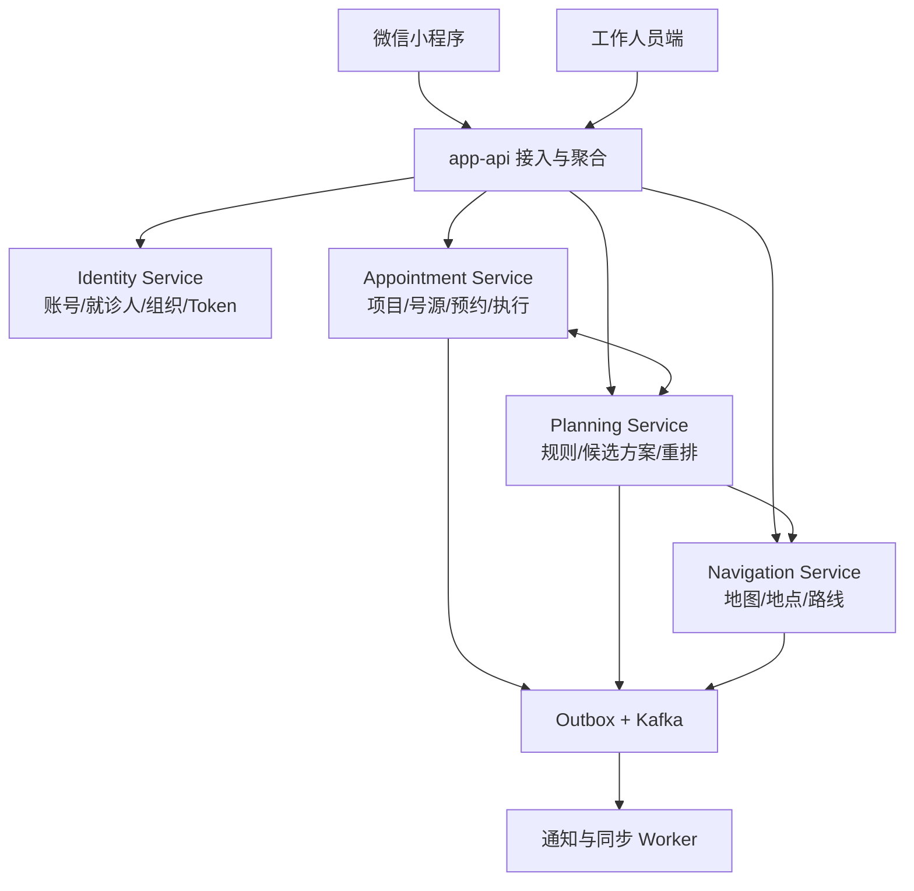

# Hospital 总体功能架构

> 文档状态：总体功能基线
>
> 本文回答“产品由哪些能力构成、它们之间如何协作”。具体业务规则和流程放在 `requirements/` 目录继续讨论。

## 1. 产品定位

Hospital 是一个以微信小程序为主要患者入口的医院检查预约与行程规划平台。

当前已经明确的核心价值是：用户为本人或家属选择一个或多个检查项目，系统结合可用号源、检查规则和院内地点生成可执行的预约与检查顺序，并在就医过程中提供预约管理、地图导航、消息提醒和报告查询能力。

系统不负责替代医生进行诊断，也不因为用户可以自行选择项目，就自动判断某项检查在医学上必然适合该用户。需要医学确认的项目应明确提示限制、材料要求或人工确认流程。

## 2. 患者端主流程

```text
微信登录
  -> 选择或维护就诊人
  -> 选择一个或多个检查项目
  -> 选择院区、日期和可接受时间范围
  -> 系统组合号源并生成候选检查顺序
  -> 用户确认后统一创建预约
  -> 在“我的预约”中查看准备事项、状态和地点
  -> 使用院内地图完成检查间导航
  -> 接收预约、改签、到院、重排和报告通知
  -> 检查完成后查看已发布报告
```

首版建议同一个候选方案中的项目全部预约成功或全部失败，避免产生难以理解和补偿的半成品行程。

## 3. 总体功能模块

### 3.1 身份、组织与权限

- 微信用户、后台工作人员和系统服务身份；
- 本人及家属就诊人管理；
- 医院、院区、部门和工作人员归属；
- 登录、Token、账号状态和授权版本；
- 超级管理员、部门医生及后续可扩展角色；
- 各业务服务基于角色、部门、资源归属和业务状态执行本地授权。

### 3.2 检查目录与预约

- 检查项目、准备事项、可预约机构和地点；
- 设备、资源、排班、时段、容量和号源；
- 用户检查清单、预约总单和项目预约；
- 号源试算、占用、确认、释放、取消和改签；
- 报到、开始、完成、失约和异常状态；
- “我的预约”及预约历史。

### 3.3 检查顺序规划

- 准备条件、先后关系、间隔和冲突规则；
- 根据项目、候选号源、地点和用户偏好生成候选方案；
- 记录算法版本、规则版本、输入、输出和解释；
- 预约或执行状态变化后的动态重排；
- 工作人员人工调整及原因记录。

### 3.4 地图导航

- 建筑、楼层、房间和服务地点；
- 地图资源及版本发布；
- 导航节点、路径、无障碍路线和路线说明；
- 预约项目、方案步骤与检查地点关联；
- 地点关闭、迁移和路线失效处理。

首版可以从楼层图、地点定位和预设路线开始，不提前承诺室内实时定位。

### 3.5 患者配套能力

- 就医通知：预约成功、改签、临近到院、地点变化、方案重排和报告发布；
- 报告查询：查看已发布的检查报告及其更正版本；
- 公告栏：按平台、医院、院区或部门发布公共信息；
- 设置、隐私、客服和异常反馈。

通知是发给具体用户的业务触达；公告是按范围公开展示的信息，两者不合并成同一个业务对象。

### 3.6 工作人员端能力

- 组织、人员、检查项目和地点维护；
- 排班、资源和号源管理；
- 预约确认、取消、改签和异常处理；
- 检查规则录入、版本和发布；
- 检查方案查看与人工调整；
- 地图编辑和版本发布；
- 报告接入、消息模板、公告和审计查询。

## 4. 功能与服务边界



这里的模块和小程序菜单不是一一对应关系：

- “我的预约”是 Appointment Service 的患者端入口，不是独立服务；
- 就诊人管理属于 Identity Service；
- 通知首期是事件消费者和 Worker；
- 报告、公告首期先保持独立代码模块，达到拆分条件后再形成服务；
- `app-api` 负责接口聚合，不拥有核心业务事实。

具体服务职责、数据库归属和共享方式见 `02-service-and-data-boundaries.md`。

## 5. 当前优先级

### 第一阶段：核心预约闭环

- 最小身份登录和就诊人；
- 医院、部门、地点和检查项目主数据；
- 资源、时段、容量和号源；
- 多项目选择、候选方案和统一预约；
- 我的预约和基础通知。

### 第二阶段：到院过程

- 楼层地图和路线指引；
- 报到、检查执行和动态重排；
- 地点变化与候检通知。

### 第三阶段：检查结果与运营

- 报告接入和安全查询；
- 公告、客服、异常工单和运营分析；
- 根据真实复杂度拆分报告、通知或内容服务。

## 6. 当前文档边界

本文只作为稳定的功能总览。以下内容进入 `requirements/` 目录逐项讨论：

- 各模块的参与者、主流程和异常流程；
- 状态机和业务规则；
- 首版范围和暂缓范围；
- 页面、接口、字段和验收标准。

业务规则确认后，再把对应的数据表、RPC、事件和开发任务细化到正式设计文档中。
