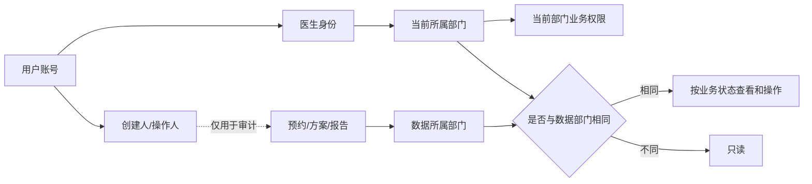

# 身份与权限业务设计概览

> 文档状态：已形成首版业务规则，细节待继续讨论
>
> 参考：`Medicine/docs/plans/00-overall-framework.md`

## 1. 当前已经确认的规则

后台工作人员首期分为两个层级：

1. **超级管理员**：管理平台、组织、账号及跨部门业务数据。
2. **部门医生**：当前只归属于一个部门；对本部门数据拥有完整业务操作权限，对其他部门数据只允许查看。

部门医生可以查看其他部门的完整患者资料和检查报告，但不能修改其他部门的数据。跨部门查看属于敏感操作，后续需要纳入审计。

患者、预约、检查方案和报告不与某个医生永久绑定。业务数据归属于产生该业务的部门，医生只是创建者、处理人或操作人。

患者账号可以管理已经建立有效关系的家属就诊人，并查看家属的预约、检查方案和完整报告。家属关系如何建立和验证后续单独设计，首期权限模型先保留这一业务能力。

## 2. 首版权限矩阵

| 身份 | 本部门数据 | 其他部门数据 | 平台配置 |
|---|---|---|---|
| 超级管理员 | 查看和管理 | 查看和管理 | 查看和管理 |
| 部门医生 | 查看和完成正常业务操作 | 查看，包括完整患者资料和报告 | 不允许 |

“本部门完整业务操作权限”是指医生可以执行本部门业务模块提供的全部操作，但仍然受到业务状态限制。例如：

- 已完成的预约不能任意改回未开始；
- 已发布的报告不能直接覆盖历史版本；
- 已执行的检查步骤不能从历史中物理删除；
- 已生效的规则需要通过新版本或停用流程修改。

角色权限不能绕过业务状态机和历史保留规则。

首期不在医生内部继续划分编辑、审核、发布等权限层级，但权限接口和能力命名需要允许后续把“全部权限”拆分成更细的操作授权。

## 3. 权限判断需要哪些信息

每次授权至少需要四类信息：

```text
操作人：是谁、是什么角色、当前属于哪个部门
业务对象：预约、方案、报告或其他数据
数据归属：业务对象属于哪个部门
操作动作：查看、创建、修改、取消、发布、导出等
```

当前基本规则可以表达为：

```text
如果是超级管理员：
    按业务状态允许操作

如果是部门医生，且数据属于当前部门：
    按业务状态允许操作

如果是部门医生，且数据属于其他部门：
    只允许查看

其他情况：
    拒绝
```

所有需要部门隔离的业务数据都必须能够确定所属部门。创建人和最后修改人用于追溯，不用于决定数据归属。

## 4. 医生调岗与历史数据

医生当前暂定只属于一个部门。医生调岗时只修改医生当前所属部门，不迁移任何历史业务数据。

例如：

```text
张医生原来属于影像科
    -> 影像科历史预约、方案、报告仍归影像科

张医生调到检验科
    -> 对检验科数据拥有本部门业务权限
    -> 对影像科历史数据变为跨部门只读
```

这样可以避免患者、报告或预约与某个医生永久绑定，也能保证部门历史数据的连续性。

当前业务不存在必须由原医生继续处理的“原部门未完成事项”，因此医生调岗后立即按照新部门权限工作，不保留对原部门的修改权限。

未来如果允许医生同时属于多个部门，应扩展为“医生—部门授权关系”，而不是在业务数据上增加多个医生归属字段。

## 5. 账号、医生、部门和业务数据的关系



患者账号与就诊人需要分开。一个账号可以管理本人、子女、父母或其他已建立有效关系的家属就诊人；账号可以为家属办理业务并查看家属完整报告。预约、方案和报告最终归属于就诊人，而不是登录微信账号本身。

## 6. 多服务架构下的职责划分

后端会拆分为地图、检查顺序规划以及后续预约、报告等多个服务，因此建议建立独立的 **Identity Service（身份与组织服务）**。

Identity Service 负责保存身份事实：

- 用户和医生账号；
- 超级管理员或部门医生角色；
- 医生当前所属部门；
- 部门和基础组织关系；
- 登录、Token、账号禁用和授权版本；
- 医生调岗和角色变更。

Identity Service 不负责远程判断每一条预约或报告能否操作。具体授权由拥有该数据的业务服务完成：

| 服务 | 自己负责的权限判断 |
|---|---|
| Map Service | 谁可以查看、编辑和发布地图、科室位置和路线数据 |
| Planning Service | 谁可以创建、调整和查看检查顺序方案 |
| Appointment Service | 谁可以创建、确认、改签和取消预约 |
| Report Service | 谁可以查看、发布、更正、下载或导出报告 |

典型请求流程：

```text
医生登录
  -> Identity Service 验证身份并签发 Token

医生请求业务服务
  -> 业务服务本地验证 Token
  -> 获取医生角色和当前部门
  -> 读取业务对象所属部门
  -> 使用公共权限规则完成本地判断
```

这样 Identity Service 故障不会让已经持有有效 Token 的所有业务请求立即停止，也避免每次操作都增加一次远程权限调用。

## 7. 公共权限能力

多个服务需要复用相同的基础判断，公共代码可以放在：

```text
common/authn/    # 身份上下文和 Token 验证
common/authz/    # 角色、部门范围和操作判断
```

公共权限代码只负责通用策略，例如“同部门可操作、跨部门只读”。业务服务仍然负责：

- 确定数据属于哪个部门；
- 判断当前业务状态是否允许该动作；
- 判断报告、预约或规则是否存在额外限制；
- 记录关键操作和跨部门访问。

不建立所有请求都必须同步调用的独立权限判断服务。

## 8. 为未来扩展预留的维度

### 8.1 组织层级

当前以部门为主要范围，未来可以扩展为：

```text
平台 -> 医院 -> 院区 -> 部门/科室
```

业务数据应保留组织归属扩展空间，但首期不必实现完整多医院权限后台。

### 8.2 多部门任职

当前医生只有一个部门。未来可以支持主部门、兼职部门、临时支援和授权有效期。

### 8.3 操作类型

首期对本部门医生统一授予全部业务操作，对其他部门统一授予只读。公共授权接口仍按具体动作接收参数，为未来继续拆分以下能力预留空间：

- 创建；
- 修改；
- 取消或作废；
- 审核；
- 发布；
- 下载；
- 打印；
- 批量导出；
- 授权他人；
- 人工调整算法结果。

查看、下载和批量导出不应默认视为同一种权限。

建议后续权限接口采用类似以下抽象，而不是只提供 `IsAdmin` 或 `IsSameDepartment`：

```text
Authorize(actor, action, resourceType, resourceDepartment, resourceOwner)
```

首期策略可以把本部门的所有 `action` 统一放行，但业务调用处仍传入真实动作。这样客户以后要求增加“审核医生”“科室管理员”或限制导出权限时，可以修改策略和授权配置，而不需要重写所有业务接口。

预留动作可以按业务域命名：

```text
appointment.read / appointment.create / appointment.update / appointment.cancel
planning.read / planning.create / planning.adjust
report.read / report.publish / report.correct / report.download / report.export
map.read / map.edit / map.publish
rule.read / rule.edit / rule.review / rule.publish
```

这些名称用于保留扩展边界，首期不开发细粒度权限配置页面。

### 8.4 数据敏感程度

患者基本资料、预约信息、检查方案和完整报告可以采用不同保护级别。当前允许医生跨部门查看完整资料和报告，但应保留以后限制某些报告类型、隐藏部分字段或增加二次确认的能力。

### 8.5 临时授权与紧急访问

未来可能出现会诊、跨科协作或紧急处理。可以扩展临时授权、授权原因、有效期和事后审计，不必通过永久修改医生部门实现。

### 8.6 系统服务身份

医院接口连接器、报告同步程序和异步任务也需要身份。系统服务账号应与人员账号分开，只获得完成任务所需的最小权限。

### 8.7 授权及时失效

未来需要处理医生离职、禁用、调岗和权限撤销后的生效速度。可以通过短期 Token、授权版本和必要缓存失效实现，不把角色和部门永久写死在长生命周期 Token 中。

## 9. 审计与追溯

业务表中的 `created_by`、`updated_by` 只能表示创建者和最后修改者，不能替代完整审计。

后续审计至少需要覆盖：

- 医生跨部门查看患者资料和报告；
- 预约创建、确认、改签、取消和人工调整；
- 检查顺序方案的人工修改；
- 报告发布、更正、撤回、下载和导出；
- 医生调岗、账号禁用和角色变更；
- 超级管理员访问敏感医疗数据。

审计需要记录操作人、时间、业务对象、动作、结果、所属部门和请求标识。具体存储方案可以后续单独设计，但所有服务应保留统一身份上下文。

## 10. 首期实施边界

首期先实现：

- 超级管理员和部门医生两类后台身份；
- 每名医生一个当前部门；
- 业务数据保留部门归属；
- 医生本部门拥有全部业务操作权限、跨部门只读；
- 医生调岗不改变历史数据归属；
- 医生调岗后不保留原部门修改权限；
- 患者账号可以管理已建立关系的家属就诊人并查看家属完整报告；
- Identity Service 负责登录、身份、部门和 Token；
- 各业务服务本地执行部门权限判断；
- 公共认证授权代码可以被多个服务复用；
- 业务调用按真实动作接入授权接口，为以后细分角色和能力预留空间；
- 所有请求携带统一的用户、角色、部门和请求标识上下文。

多医院、多部门任职、复杂角色后台、临时授权和紧急访问先保留扩展位置，不进入首期实现。

## 11. 仍需继续讨论的问题

1. 超级管理员是否默认可以查看完整患者资料和报告，还是只管理平台配置；
2. 跨部门只读是否包括报告下载、打印和单条转发；
3. 是否允许医生批量导出本部门或其他部门数据；
4. 地图编辑权限是超级管理员统一维护，还是允许医生维护本科室位置；
5. 哪些患者资料需要脱敏展示；
6. 家属关系通过患者自行添加、身份核验还是医院数据建立；
7. 是否存在临时会诊、跨科支援或紧急访问场景；
8. 哪些跨部门操作必须立即告警，而不只是事后审计；
9. Identity Service 不可用时，已有 Token 可以继续使用多长时间；
10. 后续增加医院和院区时，部门权限如何向上继承；
11. 客户未来增加第三层角色时，优先按岗位、操作能力还是数据范围拆分。

这些问题不会阻塞当前两级权限模型，但会影响报告、预约、地图和多医院扩展的具体设计。
