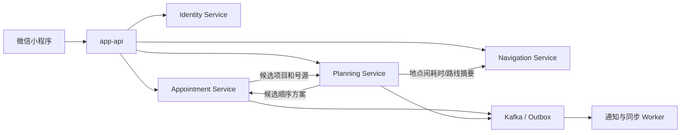

# 服务与数据边界设计

> 文档状态：首版架构决定，业务细节待继续讨论
>
> 当前前提：用户在小程序中自行选择一个或多个检查项目，系统组合号源并生成检查顺序。

## 1. 当前决定

当前确定以下四个独立业务服务：

1. **身份与组织服务（Identity Service）**；
2. **预约检查服务（Appointment Service）**；
3. **检查规划服务（Planning Service）**；
4. **地图导航服务（Navigation Service）**。

`app-api` 作为面向小程序和管理端的 API 接入层存在，但它不拥有核心业务数据，主要负责认证接入、参数转换和接口聚合。

四个业务服务分别拥有自己的代码入口、契约、数据和迁移目录。可以按照开发顺序逐个完成，但不能先把它们写成共享数据库的内部包，再依赖跨表查询维持业务。

特别说明：Identity Service 是身份事实服务，不是集中权限裁决服务。它负责登录、账号、组织、角色和 Token；Appointment、Planning、Navigation 等服务在本地验证 Token，并结合自己拥有的业务数据完成最终授权。系统不建立每个请求都必须调用的 Permission Service。

## 2. 首期独立业务服务

### 2.1 身份与组织服务

负责：

- 微信账号和后台账号；
- 登录、Token、账号状态；
- 就诊人和账号—就诊人代理关系；
- 医院、院区、部门以及工作人员归属；
- 角色和权限身份事实。

不负责预约状态、检查方案和报告内容。其他业务服务只保存 `account_id`、`patient_id`、`department_id` 等稳定标识及必要快照。

就诊人管理是该服务的患者端功能，不需要再拆一个“就诊人微服务”。

### 2.2 预约检查服务

这是核心交易服务，负责：

- 检查项目目录及项目可预约范围；
- 用户选择的检查清单；
- 检查资源、排班、时段、容量和号源；
- 预约总单、项目预约和状态历史；
- 号源试算、占用、确认、释放、取消和改签；
- 报到、开始、完成、失约等执行状态；
- 防重复提交、并发占号和业务幂等。

只有预约检查服务可以最终决定号源是否可用，并执行占用或释放。Planning Service 可以推荐时段，但不能直接修改号源库存。

“我的预约”是该服务对患者提供的查询与操作入口，不是独立微服务。

### 2.3 检查规划服务

负责：

- 检查准备条件、先后关系、间隔和冲突规则；
- 根据项目、候选号源、地点和用户偏好计算候选方案；
- 保存规划任务、算法版本、规则版本、候选结果和原因说明；
- 预约变化或检查执行变化后的重新规划；
- 人工调整结果及其原因。

它适合独立的原因是：规则与算法是项目核心能力，计算负载和发布节奏可能与普通 CRUD 不同，而且需要独立复盘某次计算使用的输入和规则版本。

Planning Service 不拥有预约订单，也不能绕过 Appointment Service 锁定号源。

### 2.4 地图导航服务

负责：

- 建筑、楼层、房间和导航地点；
- 地图资源及地图版本；
- 导航节点、路径、路线和无障碍属性；
- 地点关闭、迁移和路线失效；
- 两个地点之间的路线查询。

它适合独立的原因是地图数据结构、版本发布和路径计算与预约交易差异较大，未来也可能使用不同的存储、缓存和静态资源方案。

医院、院区和部门的身份主数据归 Identity Service；建筑、楼层、房间和路径归 Navigation Service。双方通过稳定组织 ID 关联，避免重复维护同一份组织结构。

## 3. 首期不建议单独拆分的能力

| 患者侧功能 | 首期归属 | 原因 |
|---|---|---|
| 就诊人管理 | Identity Service | 属于账号、代理关系和身份数据 |
| 我的预约 | Appointment Service + app-api 聚合 | 是预约生命周期入口，不是新的业务数据领域 |
| 报告查询 | 接口确认前只设计需求和适配契约，实现时再建立 Report Service | 依赖真实医院报告来源和安全边界 |
| 就医通知 | 异步 Worker/消息模块 | 是预约、规划、报告事件的消费者 |
| 公告栏 | 先作为运营内容模块 | 业务简单，独立部署收益很低 |
| 我的关注 | 内容或用户偏好模块 | 首期没有独立事务和扩缩容需求 |

不要按照小程序首页的每一个菜单创建一个服务。页面可以同时聚合多个服务的数据，一个服务也可以支持多个页面。

## 4. 建议后续按条件拆分的服务

### 4.1 报告服务（Report Service）

拿到真实 LIS、PACS 或医院报告接口后再独立。触发条件包括：

- 需要接入多种报告来源；
- 报告附件、版本、更正和撤回形成独立生命周期；
- 报告权限和审计明显严于普通预约；
- 报告同步需要独立重试、限流和扩缩容。

拆分后负责报告元数据、版本、附件引用、外部映射和访问审计，不负责生成医学诊断。

### 4.2 消息通知服务（Notification Service）

首版先实现异步通知 Worker。出现多个发送渠道、模板运营、发送量增大、复杂补发和触达统计后，再升级为独立服务。

业务服务只发布“预约成功”“地点变化”“报告发布”等领域事件，不直接拼接微信消息模板。

### 4.3 内容运营服务（Content Service）

公告、资讯、关注和运营内容数量明显增加，并需要独立审核、定时发布和搜索后再拆。只有公告栏时不值得创建独立微服务。

## 5. 推荐调用关系



推荐预约流程：

```text
用户选择检查项目、院区、日期范围
  -> Appointment Service 查询候选号源
  -> Planning Service 计算一个或多个候选组合
  -> app-api 返回候选方案
  -> 用户选择并确认
  -> Appointment Service 重新校验并原子占用全部号源
  -> 创建预约总单和各项目预约
  -> 发布预约成功事件
  -> Planning Service 固化已确认方案
  -> 通知 Worker 发送结果
```

首版建议采用“同一方案内全部项目预约成功，或者全部失败”。如果允许部分成功，患者将面对难以理解的半成品方案，系统还需要补偿、重排和再次确认，复杂度会明显增加。

## 6. 数据库与数据归属

每个核心数据只能有一个服务拥有写权限：

| 数据 | 数据拥有者 |
|---|---|
| 账号、就诊人、代理关系、部门 | Identity Service |
| 检查项目、资源、号源、预约、执行状态 | Appointment Service |
| 规则、计算任务、方案版本和方案步骤 | Planning Service |
| 地图版本、地点、节点和路线 | Navigation Service |
| 未来的报告与报告版本 | Report Service |

### 6.1 独立数据库是什么意思

微服务应拥有独立的逻辑数据库边界。首期为了降低成本，可以把多个数据库放在同一个 MySQL 8.4 实例中，但仍按服务隔离：

```text
同一个 MySQL 实例（首期允许）
├── hospital_identity       Identity Service 专用数据库
├── hospital_appointment    Appointment Service 专用数据库
├── hospital_planning       Planning Service 专用数据库
└── hospital_navigation     Navigation Service 专用数据库
```

每个数据库使用独立账号和迁移目录，服务账号只拥有自己数据库的权限。以后需要容量或安全隔离时，可以把某个数据库迁移到独立实例，而不需要先清理跨库联表依赖。

“独立数据库”不等于首期必须准备四台 MySQL 服务器；它强调的是数据所有权和访问边界。

### 6.2 强制约束

1. 一个服务只能直接读写自己的数据库。
2. 不建立跨服务数据库外键、跨库 JOIN、触发器或共享业务表。
3. 每个服务独立维护迁移版本和回滚策略。
4. 其他服务保存的外部 ID 只是引用，不获得对应数据的写权限。
5. `common` 不提供绕过服务边界的公共业务 Model 或数据库连接。
6. 报表查询也不能直接连接所有业务库；首期由 `app-api` 聚合，复杂后建立事件驱动的只读数据集。

### 6.3 哪些数据可以复制

跨服务允许保存两类副本：

- **历史快照**：预约时的项目名称、地点名称、准备事项等，用于还原当时事实；源数据后来修改时不反向覆盖历史订单。
- **本地读模型**：通过事件同步的部门名称、地点摘要等高频只读数据；允许短暂延迟，但必须能从拥有者重新构建。

副本必须标明来源 ID、来源版本或更新时间，不能在消费服务中反向修改后当作主数据。

## 7. 跨服务数据共享方式

### 7.1 Token：共享身份上下文

Identity Service 在登录或刷新时签发短期 Token，包含用户 ID、账号类型、角色、当前部门、授权版本和有效期。业务服务通过 `common/authn` 本地验证签名，通过 `common/authz` 执行通用角色和部门判断，再结合本地业务状态完成最终授权。

业务请求不为了权限判断同步调用 Identity Service。账号禁用、调岗和角色变化通过短期 Token、授权版本及必要的撤销缓存控制生效速度。

### 7.2 zRPC：获取必须立即准确的数据

当一次操作必须得到最新结果才能继续时使用 zRPC。例如：

- `app-api` 获取当前就诊人详情；
- Appointment Service 请求 Planning Service 计算候选方案；
- Planning Service 请求 Navigation Service 获取地点间预计耗时。

RPC 必须设置超时和明确错误，不用链式 RPC 完成长事务。

### 7.3 Outbox + Kafka：传播已经发生的状态变化

业务服务在本地事务中同时写入业务数据和 Outbox，再异步发布事件。例如：

```text
identity.department.updated.v1
appointment.confirmed.v1
appointment.cancelled.v1
planning.plan.confirmed.v1
navigation.place.changed.v1
report.published.v1
```

消费者按 `event_id` 幂等处理。事件用于通知、同步读模型和触发后续任务，不用于替代用户正在等待的同步命令结果。

### 7.4 app-api：面向页面聚合

小程序的“我的预约详情”可能同时需要预约、方案、路线和消息摘要。由 `app-api` 调用相应服务并组装响应，不能要求小程序直接理解内部微服务拓扑，也不能为页面方便建立跨库查询。

### 7.5 快照：保留历史业务事实

预约确认时保存当时的项目名称、准备事项、地点摘要和时段信息。规划方案保存规则版本、地图版本和输入摘要。快照只用于历史还原，不替代主数据服务。

## 8. 跨服务一致性

单个服务内部使用本地数据库事务。跨服务不使用数据库分布式事务，按照业务语义选择以下方式：

- 用户必须立即得到结果：同步 RPC + 明确失败，最终写入仍由数据拥有者完成；
- 已经发生的状态变化：本地事务 + Outbox + Kafka；
- 可接受短暂延迟的展示数据：事件同步本地读模型；
- 失败后可恢复的流程：状态机、幂等命令、重试和补偿操作。

预约确认是最重要的事务边界：Appointment Service 在自己的数据库内重新校验并原子占用全部号源、创建预约。Planning Service 只能提供候选方案，不能跨库锁号。预约成功后再通过事件固化规划结果和发送通知。

## 9. 分阶段落地

### 阶段一：建立首期服务骨架

- 保留 `app-api`；
- 建立独立 Identity Service，先完成登录、Token、账号、就诊人和最小组织数据；
- 优先开发 Appointment Service；
- Planning 和 Navigation 建立独立服务目录、契约、数据库和迁移目录；
- 通知、公告、报告先作为模块或 Worker。

### 阶段二：形成核心闭环

- 独立运行 Identity、Appointment、Planning 和 Navigation；
- 使用 zRPC 完成同步调用；
- 用 Outbox 和 Kafka 传递预约、方案和地点变化事件；
- 完成端到端测试和失败补偿。

### 阶段三：根据真实接入拆分

- 有真实报告系统后拆 Report Service；
- 通知渠道和发送量复杂后拆 Notification Service；
- 公告、资讯和关注形成完整运营体系后拆 Content Service。

## 10. 当前仍需确认

1. 用户一次是否可以选择多个检查项目；
2. 用户只选择目标日期范围，还是逐项选择具体时段；
3. 一个方案内是否接受部分项目预约成功；
4. 检查项目是否都可以由患者自行选择，还是部分项目需要提示人工确认；
5. 首版地图只是楼层图与路线指引，还是必须计算实时路线；
6. Identity Service 首期的患者端登录和工作人员登录采用哪些具体方式。

其中第 1 至第 3 项会直接决定预约订单、号源锁定和规划接口，应优先确认。
