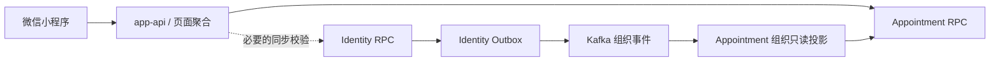

# 组织目录投影与 Appointment 资源树优化提案

> 状态：未排期优化提案，不属于 Appointment 第一阶段验收范围
>
> 目的：消除小程序对 Identity 与 Appointment 服务拓扑的理解，统一支持院区切换和两套三级资源视图

## 1. 当前问题

当前前端为了使用已经存在的接口，临时执行以下编排：

```text
小程序
  -> Identity App API：医院、院区、科室
  -> 选择 department_id
  -> Appointment App API：房间、项目关系和周配置
  -> 前端合并为页面状态
```

该方案可以完成首版联调，但不应成为最终边界。它使小程序理解服务拆分，必须处理跨服务缓存、部分失败、
迟到响应和同名科室映射，也不符合“页面聚合由 App API 完成”的既定技术基线。

本提案只优化读取和跨服务验证，不改变数据所有权：医院、院区、科室仍由 Identity 唯一写入；检查项目、房间、
房间—项目关系、周配置、容量和预约仍由 Appointment 唯一写入。

## 2. 目标页面模型

院区作为页面上下文切换器，不占用三级业务浏览中的一列：

```text
患者端：院区切换器 + 科室 -> 检查项目 -> 可选房间
管理端：院区切换器 + 科室 -> 房间 -> 可执行检查项目
```

- 患者可以切换当前医院下所有 active 院区；
- 超级管理员可以切换其授权范围内的院区；
- 科室医生固定使用 Token/Identity 会话中的院区和科室；
- 同名科室始终以 `campus_id + department_id` 区分，名称只用于展示；
- 时间窗口、精确容量和写操作按选中资源继续使用独立接口，不把全部明细塞入首屏资源树。

## 3. 推荐调用边界



小程序只调用 App API 的页面接口，不直接编排 Identity 与 Appointment。App API 负责 HTTP 契约、身份上下文和
页面 DTO；Appointment 负责基于本地业务事实与组织只读投影生成资源树。

不得让 Appointment 或 App API 直接查询 Identity 数据库，也不建立跨库外键或分布式事务。

## 4. Kafka 组织投影

Identity 在创建、修改、启用或停用医院/院区/科室的本地事务中同时写入 Outbox，发布统一版本化事件。建议使用
一个稳定事件类型，例如：

```text
identity.organization-unit.changed.v1
```

事件最少包含：

```json
{
  "unit_id": "stable UUID",
  "unit_type": "hospital | campus | department",
  "parent_id": "stable UUID or null",
  "hospital_id": "stable UUID",
  "code": "RAD",
  "name": "放射科",
  "status": "active | disabled",
  "version": 3,
  "operation": "created | updated | enabled | disabled"
}
```

具体事件名和 Schema 在实施前进入 `contracts/events` 评审，不直接以数据库审计 payload 作为公开事件契约。

Appointment Consumer 的约束：

- 以 `event_id` 幂等，按 `unit_id` 保存最后应用的单调 `version`；
- 重复、乱序和旧版本事件不得回退投影；
- 本地表只保存资源树所需的稳定 ID、父子关系、名称、状态和版本；
- 提供全量快照初始化与定期对账，不能假设 Consumer 从系统第一天开始永久在线；
- 监控 Consumer Lag、最后成功时间、版本冲突、死信和对账差异；
- 展示读取允许短暂最终一致，预约占号与容量仍完全在 Appointment 本地强一致完成。

## 5. gRPC / zRPC 使用范围

同步 RPC 用于当前请求必须得到权威结果的场景，不用于每次热点列表读取：

- 创建检查项目或房间时，必要时确认 `department_id` 仍存在且 active；
- 超级管理员跨科室写入时确认授权范围；
- 投影尚未完成初始化或检测到不可接受的版本缺口时进行受控兜底；
- 运维对账或投影重建时获取组织快照。

普通院区切换、科室列表和资源树读取使用本地投影。Identity 暂时不可用时，已投影的只读页面仍可服务；必须进行
权威校验的写操作在 Identity/RPC 不可用时失败关闭，不能凭前端传入名称或陈旧缓存放行。

## 6. App API 提案

准确路径在实施时进入 `contracts/api` 和 OpenAPI 评审。建议页面契约按用途分开：

```text
GET /api/v1/appointment/resource-browser/context
    当前医院、可切换院区、当前工作人员固定范围

GET /api/v1/appointment/patient/resource-tree?campus_id={campus_id}
    active 科室 -> active 项目 -> active 房间

GET /api/v1/admin/appointment/resource-tree?campus_id={campus_id}&status=active
    科室 -> 房间 -> 可执行项目及管理状态摘要
```

患者 DTO 不返回版本、管理容量、停用资源、operation ID 或内部审计字段。管理 DTO 可以返回资源 ID、状态和版本
摘要，但周配置详情仍按房间/项目单独加载。院区资源过多时，将树拆为“院区科室摘要 + 单科室资源树”，不能用
一次超大响应替代分页和按需读取。

## 7. 缓存与失效

- Identity 组织事件更新投影后，失效对应 `campus_id` 的资源树缓存；
- Appointment 项目、房间或关系写入成功后，在本地事务提交后失效对应 `department_id/campus_id` 缓存；
- Redis Key 必须包含视图类型、院区、状态和契约版本，患者与管理端不能共用返回值；
- App API 可以做很短的响应缓存和请求合并，但不保存核心事实；
- 缓存命中只优化读取，预约创建仍在 Appointment 数据库事务内原子检查窗口、容量和重复预约；
- 不通过 Redis 自增结果或前端缓存判断是否预约成功。

## 8. 分阶段落地

### O1：收回前端聚合

- 在 App API 增加资源浏览 DTO；
- 首期可由 App API 并行调用 Identity RPC 与 Appointment RPC；
- 小程序改为只消费资源浏览接口；
- 统一院区切换、权限、超时、部分失败和 Trace。

该阶段先消除前端服务缠绕，但 Identity 仍是同步读取依赖。

### O2：建立组织事件投影

- 评审组织事件 Schema；
- Identity 使用本地事务 Outbox 可靠发布；
- Appointment 建立幂等 Consumer、快照初始化、对账和监控；
- 资源树切换为本地投影读取，移除热点列表对 Identity RPC 的同步依赖。

### O3：删除兼容编排

- 前端资源浏览不再调用 Identity 目录和 Appointment 列表进行手工拼接；
- 保留 Identity 目录接口供纯组织目录页面使用；
- 删除临时 Adapter 状态与重复缓存键；
- 完成灰度、响应一致性对比和回滚开关后再移除旧路径。

## 9. 验收标准

- 小程序不能从页面代码推断 Identity/Appointment 拓扑；
- 院区切换只改变上下文，患者和管理端仍分别保持确定的三级顺序；
- 同名科室、跨院区切换和资源停用均以稳定 ID 正确处理；
- Identity 短时不可用不影响已投影的资源树读取；
- 投影重复、乱序、重放和全量重建有自动化测试；
- 写操作继续由后端鉴权，医生不能通过请求参数越过所属科室；
- 患者资源树不泄露管理字段和 disabled 资源；
- Kafka Lag、投影新鲜度、资源树延迟/错误率和缓存命中率可观测；
- 预约并发与容量正确性不依赖 Kafka、Redis 或前端状态。

## 10. 非目标

- 本提案不要求现在修改第一阶段已经实现的 CRUD 与周配置；
- 不创建独立的 Organization Query Service，除非后续出现多个领域共同消费且容量边界成立；
- 不把医生变成预约资源，不改变项目、房间和科室的既定关系；
- 不通过 Kafka 执行需要患者立即得到结果的预约命令；
- 不在本提案中实现跨医院切换。当前 Identity 上下文只覆盖当前医院及其院区；跨医院需要单独的授权和上下文设计。
