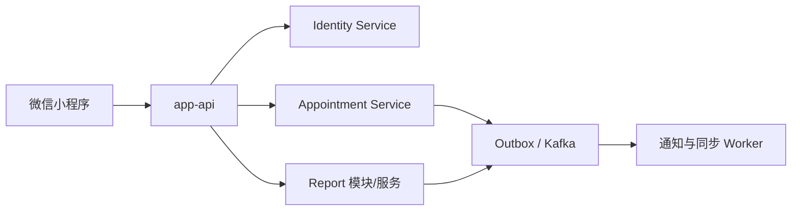

# 后端服务与数据边界

> 状态：当前有效架构边界。Appointment 业务细节以
> [Appointment 预约检查服务 Plan](../modules/01-appointment-and-examination-booking.md) 为准。

## 1. 当前服务决定

当前确定两个主要业务服务边界：

1. **Identity Service**：登录账号、手机号、Token、角色、医院、院区、科室和工作人员；
2. **Appointment Service**：检查项目、检查房间、独立周配置、活动容量、独立预约、建议顺序、叫号和检查执行。

`app-api` 是微信小程序唯一 HTTP 接入层，负责协议适配和页面聚合，不拥有核心业务事实。

当前不建立 Planning Service。每个检查项目形成一条独立预约和执行链路；Appointment 内部根据固态时间
约束、患者已选房间和移动耗时计算建议执行顺序，但顺序不是跨预约事务，不自动创建、取消或修改预约。

Identity 是身份事实服务，不是集中权限裁决服务。Appointment、未来 Report 等服务在本地验证
Token 和授权版本，再结合自身数据完成资源所有权、科室范围和状态机判断。

## 2. 数据所有权

| 数据 | 唯一写入者 |
|---|---|
| 账号、手机号、Token、工作人员角色、医院、院区、科室 | Identity Service |
| 当前手机号对应的本人账号/档案 | Patient 模块；内部 ID 方案仍待评审 |
| 检查项目及文字描述；未来的准备动作、固态时间约束及规则版本 | Appointment Service |
| 检查房间及房间—项目关系 | Appointment Service |
| 房间开放周配置、项目预约周配置、停止新增时间和房间共享活动容量 | Appointment Service |
| 独立预约、建议顺序、报到、队列、叫号和检查执行 | Appointment Service |
| 报告正文、附件、版本、发布、更正和撤回 | Report 模块；是否独立部署待报告流程确认 |
| 通知投递和阅读状态 | Message/Notification 模块或 Worker |

跨边界只保存稳定 ID 和必要历史快照，不建立跨服务数据库外键、跨库 JOIN、共享业务表或公共业务 Model。

## 3. Appointment 边界

Appointment 是预约和执行交易的事实源，负责：

- 检查项目目录，以及嵌入 `description` 的患者说明和基础条件；
- 一个科室拥有的检查房间，以及房间与本部门项目的多对多关系；
- 房间开放时间/共享容量与项目预约时间/停止新增时间两条独立周配置；
- 一次一个检查项目的独立预约；
- 后续从指定描述版本提取并审核的固态时间约束，以及可替换求解器的建议顺序计算；
- 预约限制、处罚事件和限制状态；
- 取消、报到、排队、叫号、过号、失约、开始和完成；
- 患者取消、医院取消、失约和完成后的容量释放；
- 幂等、并发、状态历史、业务审计和 Outbox。

Appointment 不修改 Identity 的科室，不保存报告正文，也不把建议顺序当作跨预约事务。

## 4. 本人档案边界

首期本人档案按照已验证手机号建立或匹配。Appointment 不重复保存明文手机号，而是引用当前手机号对应的
内部本人 ID。最终复用 `account_id` 还是建立一对一 `patient_profile_id`，需要结合手机号换绑、号码回收和
历史预约归属后确定。

Patient 首期可以作为 App API 内部模块交付，但不能把医疗业务资料重新写入 Identity 账号表。家庭成员和
代理授权不进入当前范围。

## 5. 房间与移动信息边界

Appointment 拥有检查房间这个预约资源，包括所属科室、名称、启停、开放时间和共享活动容量。以后需要楼栋、
楼层、坐标或房间间移动时间时，作为房间空间元数据或检查顺序模块输入增量实现，不要求独立 Navigation Service。

## 6. Report 边界

报告是完整检查闭环的必需能力。检查完成后由 Report 记录生成中、已发布、已更正和已撤回等独立状态，
并关联本人、预约、检查项目和执行记录。

报告数据来源、正文结构、附件、签署审核和版本规则确认前，可以先以内置模块交付；形成独立安全、存储、
同步或发布边界后再拆为 Report Service。检查完成和报告发布是两个事实，报告等待不能阻止释放活动容量。

## 7. 调用与事件关系



同步 RPC 用于当前请求必须立即得到的结果；已经提交的业务事实通过本地事务 + Outbox + Kafka 传播。事件
消费者按 `event_id` 幂等，事件不能替代患者正在等待的预约创建结果。

## 8. 数据库隔离

首期可以共用一个 MySQL 实例，但按逻辑数据库和账号隔离：

```text
hospital_identity
hospital_patient       进入本人档案实现时建立
hospital_appointment
hospital_report        Report 确认独立数据所有权后建立
```

每个服务只读写自己的数据库。迁移、回滚、最小权限账号和备份策略分别维护，不提前创建未实施服务的空库。

## 9. 跨服务一致性

- 用户必须立即得到结果：同步 RPC + 明确失败，最终写入由数据拥有者完成；
- 已发生的状态变化：本地事务 + Outbox + Kafka；
- 可接受短暂延迟的展示数据：事件同步本地读模型；
- 历史还原：预约保存项目、前置条件版本、科室、房间和两类窗口快照；
- 失败恢复：状态机、幂等命令、重试和有审计的人工处理；
- 不使用跨服务数据库分布式事务。

Appointment 创建预约时，在自己的事务内校验限制、窗口停止新增时间和活动容量，原子增加占用并创建
预约。取消、失约和完成同样在 Appointment 本地事务内最多释放一次容量。

## 10. 分阶段落地

1. 实现 Proto、Appointment RPC/MySQL 骨架和检查项目描述 CRUD；
2. 填写方案 A 参数，并确认结构化提取、建议顺序、叫号和报告规则；
3. 实现检查房间、房间—项目关系、两类独立周配置和热点缓存；
4. 补齐最小本人 ID；
5. 实现独立预约、取消和处罚事实；
6. 实现经审核的固态时间约束和经基准选型的建议顺序求解器；
7. 实现报到、队列、叫号、检查开始和完成；
8. 实现报告版本和患者查询；
9. 接入通知和真实医院系统；按检查顺序需要增量增加移动信息。

本概览只维护服务和数据所有权。状态机、限制参数和验收清单统一在 Appointment Plan 评审，不在多个文档
重复维护。
