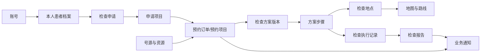

# 后端业务设计与交付路线

> 文档状态：讨论初稿
>
> 目的：确定业务主线、逐项讨论顺序、可扩展数据边界和后续开发顺序
>
> 注意：本文只确定业务骨架，不在需求尚未确认时提前锁定接口、表字段和微服务数量。

## 1. 当前产品主线

当前产品可以围绕一次完整的检查就医过程组织，而不是把功能做成彼此无关的页面：

```text
维护就诊人
  -> 在小程序中选择一个或多个检查项目
  -> 选择目标院区、日期和可接受的时间范围
  -> 系统组合可用号源并生成候选检查顺序
  -> 用户确认方案并统一创建预约
  -> 到院后查看地点、楼层和检查间导航
  -> 接收预约变化、到院和候检通知
  -> 在“我的预约”中跟踪全过程
  -> 检查完成后查看报告
```

公告栏是面向一定范围用户发布公共信息的能力，通知则是由具体业务事件触发、发送给具体用户的信息。两者应分开设计。

## 2. 功能分层

### 2.1 核心业务：预约检查机制

首版已经确认：**检查项目由用户在小程序中自行选择**，不以医生开单或医院系统同步作为创建预约的前置条件。

推荐采用“检查项目清单”模式：用户先为某个就诊人选择一个或多个项目，再选择目标院区、日期和可接受的时间范围；系统根据号源、地点和检查规则给出一个或多个可预约方案。用户确认其中一个方案后，系统再次校验号源并统一创建预约。

医生开单和医院检查申请可以作为未来新增的项目来源，但不改变后续预约模型。数据中仍应保留 `source_type` 和外部来源标识的扩展位置。

该机制不是一个简单的“提交预约”接口，而应包含以下业务能力：

1. **检查项目清单**：记录用户为某个就诊人选择的一个或多个检查项目，并在正式预约前允许增删。
2. **可预约资源**：明确项目在哪个院区、科室、地点、设备或时间段可以执行。
3. **预约订单**：记录就诊人、项目、时段、状态、来源和业务归属。
4. **容量占用**：防止同一号源超卖，并处理重复提交、并发预约和释放资源。
5. **状态流转**：至少覆盖待确认、预约成功、已取消、已报到、检查中、已完成和失约。
6. **多项检查规划**：根据时间、地点、准备条件和先后约束生成检查顺序。
7. **变更处理**：取消、改签、项目变化或执行延迟后，能够重新计算剩余安排。
8. **业务追溯**：保留预约和方案的状态历史，不能只覆盖当前状态。

这里需要区分三个对象：

- **检查清单/检查申请**：这个就诊人主动选择了哪些检查；
- **预约订单**：具体占用了哪些日期、时段或资源；
- **检查方案**：多项检查应按什么顺序完成。

三者有关联，但不能合成一张“预约表”，否则以后接入真实号源、动态重排和报告时会很难扩展。

### 2.2 第二核心：院内地图与导航

地图导航不只是展示一张图片，需要考虑：

- 医院、院区、建筑、楼层、科室、服务台和检查地点；
- 检查地点与预约项目、方案步骤之间的关联；
- 从当前位置或上一个检查地点到下一个检查地点的路线；
- 电梯、楼梯、连廊和无障碍路线；
- 地点临时关闭、迁移和地图版本更新；
- 路线无法计算时展示文字指引或人工咨询入口；
- 室外地图与院内楼层导航的边界。

首版可以先实现“地点数据 + 楼层图 + 预设路线/文字指引”，不必立即建设复杂的室内实时定位。预约详情和检查方案步骤只保存地点标识，不复制地图名称和坐标。

### 2.3 患者侧配套业务

#### 本人就诊信息

首版一个账号只维护本人。预约、方案和报告归属于稳定的本人档案，不归属于手机号。家庭成员和
代理授权不进入当前范围，后续必须基于独立授权关系设计。

#### 我的预约

它是预约生命周期的患者入口，不只是列表。需要展示预约详情、准备事项、当前状态、检查顺序、地点导航、取消或改签入口、异常原因和历史预约。

#### 检查报告查询

报告需要关联就诊人、检查项目和实际执行记录，并区分生成中、已发布、已更正和已撤回。首版重点是安全查询和展示；报告生产通常由医院 LIS、PACS 或其他系统负责，本项目负责接入、匹配和授权访问。

#### 就医通知

通知由具体业务事件产生，例如预约成功、改签、临近到院、地点变更、方案重排和报告发布。系统需要区分站内消息与微信订阅消息等发送渠道，并记录发送和阅读结果。

#### 公告栏

公告由工作人员主动发布，可按全平台、医院、院区或科室确定可见范围，并具有发布时间、有效期、置顶状态和发布状态。公告不承诺送达，紧急且必须触达的信息仍应使用通知。

## 3. 建议依次讨论的主题

讨论顺序以“先确定决定数据库和流程的规则”为原则：

### 主题一：预约检查的真实业务口径

优先确认：

1. 已确认用户可以在小程序中自行选择一个或多个检查项目；
2. 一个检查方案确认后，是生成一个包含多个项目的总订单，还是多个关联的项目预约；
3. 多个项目能否部分预约成功，还是必须全部成功或全部失败；
4. 是否存在审核、付费、确认、取消、改签、迟到和失约；
5. 号源按人数、设备时长还是固定时间段管理；
6. 用户先选择日期范围由系统推荐时段，还是必须逐项手动选择时段；
7. 哪些检查存在空腹、用药、间隔时间或严格先后关系；
8. 医院工作人员需要哪些人工调整能力。

这个主题确认后，才能设计预约状态机和核心交易表。

### 主题二：地图导航的交付深度

重点确认是做“地图展示和路线指引”，还是要做“室内实时定位和路径计算”；第一版有哪些院区、楼层和检查地点；地图数据由谁绘制、审核和更新。

### 主题三：本人档案与医院患者标识

确认首版需要的最少本人资料、`account_id` 与 `patient_profile_id` 的关系，以及未来如何通过可靠
核验绑定医院患者主索引。家庭成员代理关系后置。

### 主题四：我的预约和通知

以预约状态机为基础，逐项确定患者在每个状态能看到什么、能做什么，以及哪些状态变化必须通知。

### 主题五：检查报告接入

确认报告来源系统、患者匹配方式、报告类型、发布时间、更正机制、附件格式和访问权限。没有真实接口前可以设计适配层和模拟数据，但不应假设报告由本系统生成。

### 主题六：公告运营

确认公告发布人、可见范围、审核要求、有效期和置顶规则。它对核心交易影响较小，可以最后讨论和开发。

## 4. 可扩展数据库的领域骨架

数据库先按业务归属划分逻辑模块；这些模块不等于必须建立同等数量的微服务。

| 数据领域 | 首要业务对象 | 作用 |
|---|---|---|
| 组织与地点 | 医院、院区、部门、建筑、楼层、地点 | 为权限、预约和导航提供统一主数据 |
| 身份与本人档案 | 账号、本人患者档案、医院患者标识 | 区分登录身份和医疗业务主体 |
| 检查目录 | 检查项目、项目适用机构、准备事项 | 统一表达可以预约和执行的检查 |
| 资源与号源 | 设备/资源、排班、时段、容量 | 表达何时何地可以执行检查 |
| 检查申请 | 检查申请、申请项目、外部来源映射 | 表达就诊人需要做什么检查 |
| 预约 | 预约订单、预约项目、资源占用、状态历史 | 表达对实际资源的预订和生命周期 |
| 检查规划 | 方案、方案版本、步骤、规则快照、执行事件 | 表达多项检查顺序及动态变化 |
| 地图导航 | 地图版本、导航节点、路径、路线指引 | 将地点转换为可展示或可计算的路线 |
| 报告 | 报告、报告版本、附件、外部报告映射 | 接入并安全展示检查结果 |
| 消息与公告 | 通知、投递记录、阅读记录、公告、公告范围 | 分别承载个人触达和公共信息 |
| 平台支撑 | 外部标识映射、审计、Outbox 事件 | 支持医院接入、追溯和可靠异步处理 |

### 4.1 核心关联



### 4.2 扩展性约束

1. 所有核心对象使用平台内部稳定 ID，医院系统编号放入外部标识映射，不直接作为主键。
2. 预约、报告、方案等业务数据明确保存所属医院、院区或部门，便于以后实施数据权限。
3. 当前状态与状态历史分开保存；当前状态便于查询，历史记录用于追溯。
4. 方案、规则、地图和报告采用版本概念，已生效内容不直接被新内容覆盖。
5. 关键业务内容保存必要快照。例如项目后来改名，历史预约仍能还原预约时看到的名称和准备事项。
6. 通用字段保持明确，不采用一张万能业务表，也不大量使用 EAV 键值表。
7. JSON 只用于变化较快且不参与核心关联的扩展信息；需要筛选、约束和关联的数据使用正式字段或子表。
8. 业务删除优先使用取消、停用或作废状态；医疗业务历史、报告版本和审计记录不得随意物理删除。
9. 跨模块通过稳定业务 ID 和事件连接；未来拆成独立服务时，不依赖跨库联表才能完成核心写入。
10. 所有时间明确时区语义，数据库统一存储时间基准，接口按用户所在时区展示。

## 5. 推荐开发顺序

讨论顺序和代码实现顺序不能完全相同。推荐按以下里程碑推进：

### 里程碑 0：确认最小业务闭环

先完成预约口径、首批检查项目、首个院区、首批规则和地图交付深度的确认，并画出预约与检查执行状态机。

### 里程碑 1：基础主数据与就诊人

实现医院/院区/部门/地点、检查项目目录、账号与就诊人关系。它们是预约、地图和报告共同依赖的数据。

### 里程碑 2：最小可用预约

实现检查申请、号源、预约创建、容量占用、取消和状态历史，先打通一个项目的一次预约。并发占号、幂等和事务测试必须在本阶段完成。

### 里程碑 3：多项检查规划

在真实预约对象上实现多项目规则、顺序方案、方案版本、冲突说明和人工调整，再逐步加入动态重排。

### 里程碑 4：我的预约与就医通知

将已有预约、方案、准备事项和状态整合成患者可理解的页面，并对关键事件发送站内通知。微信订阅消息可以作为后续渠道接入。

### 里程碑 5：地图与路线联动

先把预约和方案步骤准确关联到地点，再交付楼层图、地点展示和路线指引。确认确有需求后，再增加图算法或室内定位。

### 里程碑 6：检查执行与报告

实现报到、开始、完成等执行事件，并接入报告来源、报告版本、附件和权限审计。该阶段通常依赖医院接口条件。

### 里程碑 7：公告与运营能力

实现公告发布、范围、有效期、置顶和阅读状态，随后再补充运营统计、客服和异常工单。

## 6. 服务拆分建议

当前不建议把“就诊人管理、我的预约、报告查询、通知、公告”分别做成微服务。页面入口不是服务边界。

首期可以保持少量可部署单元：

- API 接入层：面向同一微信小程序中的患者、医生和超级管理员页面提供统一 HTTP 接口；
- 预约与检查业务：检查申请、号源、预约、执行状态；
- 检查规划：规则和顺序计算；该能力是项目的核心差异点，建议保留独立服务边界；
- 地图导航：地图版本、地点和路线；如果已有独立地图交付计划，可以保持独立边界；
- 身份组织：账号、工作人员、部门和 Token；
- 异步任务：通知投递、报告同步和 Outbox 发布。

报告和公告首期可以先作为清晰的内部业务模块，不必为了名称完整而立即增加进程。后续根据数据归属、独立发布、流量和安全要求再拆分。

更具体的服务职责、数据归属和分阶段拆分方案见 [服务与数据边界](./02-service-and-data-boundaries.md)。

## 7. 下一步讨论建议

下一次先只讨论“主题一：预约检查的真实业务口径”，并最终产出：

1. 一份患者端预约主流程；
2. 一份工作人员端处理流程；
3. 预约订单和预约项目状态机；
4. 号源及容量模型；
5. 正常、取消、改签、迟到、失约和资源冲突的处理规则；
6. 首版明确支持和明确暂缓的范围。

在这六项确认前，不开始编写完整数据库建表语句。确认后先设计预约领域表，再逐步补充地图、报告和消息领域，避免数据库结构由页面菜单倒推。
