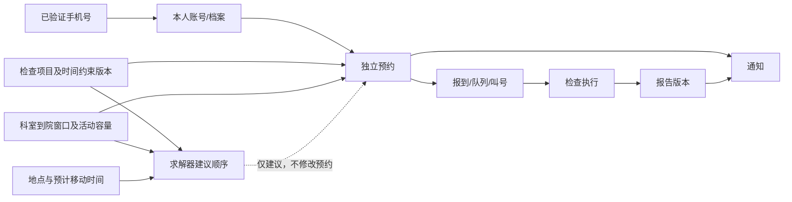

# 后端业务设计与交付路线

> 状态：当前有效交付路线。预约细节统一在
> [Appointment 预约检查服务 Plan](../modules/01-appointment-and-examination-booking.md) 人工评审。

## 1. 产品主线

```text
已验证手机号取得本人身份
  -> 选择一个检查项目
  -> 阅读并确认检查前置条件
  -> 选择院区、科室和上午/下午到院窗口
  -> 独立创建预约并占用活动容量
  -> 接收预约和到院通知
  -> 报到、排队和叫号
  -> 医生开始并结束检查
  -> 释放活动容量
  -> 生成并发布报告
  -> 患者查看报告和历史记录
```

每个检查项目形成独立预约。相同项目、同日和时间重叠预约全部允许；Appointment 可以计算建议顺序，但
不生成总订单、多项目原子事务或自动改签。

## 2. Appointment 核心能力

1. 检查项目目录、准备动作及版本化固态时间约束；
2. 项目与院区、科室、地点的可执行关系；
3. 各科室自行配置的上午/下午具体时间；
4. 窗口停止新增时间和活动容量；
5. 独立预约创建、本人查询和患者/医院取消；
6. 预约限制和惩罚方案；
7. 报到、排队、叫号、过号和失约；
8. 医生开始、结束检查和容量释放；
9. 状态历史、幂等、并发、审计和 Outbox；
10. 报告生成、发布、更正、撤回和本人查看的链路关联；
11. 结合科室窗口、时间约束和地图耗时的可替换求解器建议顺序。

## 3. 当前人工评审主题

### 主题一：预约限制和惩罚

评审曾提供三套首期方案：

- A：固定预约额度；
- B：信用积分与分级限制；
- C：失约次数触发自动临时黑名单。

客户已经选择方案 A“固定预约额度”。下一步确认统计周期、每周创建上限、同时有效预约上限、最长提前
预约天数、取消是否返还当期次数及人工豁免。方案 B/C 的信用积分和自动黑名单不进入首期。

### 主题二：检查前置条件

确认固定触发事件、`forbid/allow/not_before/not_after` 四种时间约束、规则发布和患者确认流程，以及排序
优化目标和解释输出。首期使用 MySQL 版本化关系表，不采集患者疾病、用药、年龄、性别或妊娠等个体条件；
动态类型注册、参数 Schema、Evaluator 和 DSL 作为后续扩展。

### 主题三：报到和叫号

确认报到开放/截止时间、队列顺序、叫号超时、过号、重新排队、人工优先、窗口结束和失约认定。

### 主题四：报告

确认报告数据来源、正文和附件、签署审核、版本、发布、更正、撤回、通知和患者访问权限。

### 主题五：本人和手机号

确认首期本人内部 ID、手机号换绑、号码回收和历史预约/报告归属。手机号是首期本人档案的创建和匹配依据，
但业务表不重复保存明文手机号。

### 主题六：地图与通知

确认地点、楼层图、路线、室内定位和消息渠道的首期交付深度。这些能力不能改变 Appointment 的容量和
状态事实。

## 4. 领域骨架

| 数据领域 | 主要对象 | 当前归属 |
|---|---|---|
| 身份组织 | 账号、手机号、医院、院区、科室、工作人员 | Identity Service |
| 本人信息 | 当前手机号对应的本人账号/档案 | Patient 模块 |
| 检查目录 | 检查项目、准备动作、固态时间约束、发布版本 | Appointment Service |
| 预约资源 | 科室/地点关系、到院窗口、停止新增时间、活动容量 | Appointment Service |
| 预约执行 | 独立预约、建议顺序、限制、报到、队列、叫号、检查执行 | Appointment Service |
| 地图导航 | 地点、楼层图、地图版本和路线 | Navigation Service |
| 报告 | 报告、版本、正文、附件和外部来源映射 | Report 模块/服务 |
| 消息 | 通知、投递和阅读记录 | Message/Notification 模块 |
| 平台支撑 | 审计、Outbox 和外部标识映射 | 各数据拥有者 |

核心关系：



## 5. 数据设计约束

1. 当前状态和状态历史分开；
2. 一条预约只关联一个检查项目和一个窗口；
3. 取消、失约和完成最多释放一次活动容量；
4. 预约保存项目名称、前置条件版本、科室、地点和窗口快照；
5. 首期规则只接受固定事件和四种时间约束，并以版本化关系表存储，不使用自由三元组或固定布尔列；
6. 报告使用版本，更正不覆盖历史；
7. 跨模块只使用稳定 ID、快照、RPC 和事件，不跨库联表；
8. 所有关键写操作具有幂等、审计和 Outbox；
9. 所有时间具有明确时区语义；
10. 未确定的未来能力不通过空字段、空表或空服务提前占位。

## 6. 推荐开发顺序

### 里程碑 0：完成业务评审

填写已选惩罚方案 A 的额度参数，确认固态时间约束、排序优化目标、叫号、报告和本人 ID 规则。

### 里程碑 1：最小依赖和检查目录

补齐本人身份、地点引用、检查项目、准备动作、时间约束版本和科室/地点关系。

### 里程碑 2：窗口和活动容量

实现各科室上午/下午具体时间、停止新增时间、窗口状态、容量管理及并发测试。

### 里程碑 3：独立预约和限制

实现创建、查询、取消、容量占用/释放、方案 A 固定额度，以及幂等和审计。

### 里程碑 4：建议顺序

实现固定事件约束求值、时间区间计算和地图耗时输入；通过基准选择 DFS、记忆化动态规划、A* 或混合
求解器，并输出可解释且可复现的建议顺序。

### 里程碑 5：报到、叫号和检查执行

实现报到、排队、叫号、过号、失约、开始和结束检查，验证每个终态最多释放一次容量。

### 里程碑 6：报告

实现报告录入或同步、版本、附件、审核、发布、更正、撤回、本人查询和访问审计。

### 里程碑 7：地图、通知和真实系统接入

交付地点导航、关键状态通知，并按照客户环境接入真实排班、叫号或报告来源。

## 7. 当前下一步

当前只继续人工评审 Appointment Plan，不开始建表或接口字段。客户补齐方案 A 参数和其余评审主题后，按照：

```text
Plan 批准
  -> 权限和 HTTP/Proto/事件契约
  -> 数据模型与迁移
  -> 服务骨架
  -> 纵向功能实现
  -> 并发和全链路验收
```

报告和叫号属于完整交付路线，不再作为可能删除的可选菜单；具体深度仍由相应评审主题决定。
