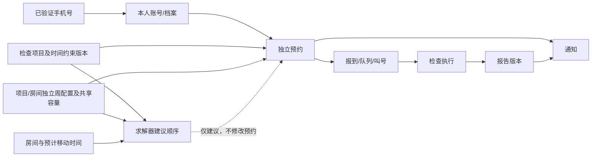

# 后端业务设计与交付路线

> 状态：当前有效交付路线。预约细节统一在
> [Appointment 预约检查服务 Plan](../modules/01-appointment-and-examination-booking.md) 人工评审。

## 1. 产品主线

```text
已验证手机号取得本人身份
  -> 选择科室和一个检查项目
  -> 阅读并确认检查前置条件
  -> 选择能执行该项目的检查房间
  -> 选择本周上午/下午到院窗口
  -> 独立创建预约并占用活动容量
  -> 接收预约和到院通知
  -> 报到、排队和叫号
  -> 授权科室工作人员开始检查
  -> 完成检查、发布首版报告并释放活动容量
  -> 患者查看当前正式报告
```

每个检查项目形成独立预约。相同项目、同日和时间重叠预约全部允许；Appointment 可以计算建议顺序，但
不生成总订单、多项目原子事务或自动改签。

## 2. Appointment 核心能力

1. 检查项目目录及包含前置规则的文字描述；
2. 科室检查房间及房间—项目关系；
3. 房间开放时间/共享容量与项目预约时间/停止新增时间两类独立周配置；
4. 患者按项目选择房间并只预约本周；
5. 独立预约创建、本人查询和患者/医院取消；
6. 预约限制和惩罚方案；
7. 报到、排队、叫号、过号和失约；
8. 授权科室工作人员开始检查，以及完成检查、首版报告发布和容量释放的原子提交；
9. 状态历史、幂等、并发、审计和 Outbox；
10. 报告草稿、首版发布、不可覆盖的更正版本和本人查看；
11. 结合患者已选房间、时间约束和移动耗时的可替换求解器建议顺序。

## 3. 当前人工评审主题

### 主题一：预约限制和惩罚

评审曾提供三套首期方案：

- A：固定预约额度；
- B：信用积分与分级限制；
- C：失约次数触发自动临时黑名单。

客户已经选择方案 A“固定预约额度”。下一步确认统计周期、每周创建上限、同时有效预约上限、取消是否返还
当期次数及人工豁免。患者只能预约当前周；方案 B/C 的信用积分和自动黑名单不进入首期。

### 主题二：检查前置条件

第一实施阶段只保存检查项目的 `description` 字符串，前置规则嵌入描述，不自动解析。后续再确认固定触发事件、
`forbid/allow/not_before/not_after` 四种时间约束、AI 提取 Schema、人工审核、排序目标和解释输出。结构化
结果必须绑定来源描述版本；动态类型注册、Evaluator 和 DSL 继续作为更后续扩展。

### 主题三：报到和叫号

确认报到开放/截止时间、队列顺序、叫号超时、过号、重新排队、人工优先、窗口结束和失约认定。

### 主题四：报告

首期报告正文、草稿、首版原子发布、更正版本和患者本人访问已经确认并完成后端实现。前端实施前继续确认
项目报告模板、患者搜索展示标识，以及科室、院区和工作人员名称的稳定快照。附件、签章、多人审核、撤回审批
和发布通知进入后续阶段。

### 主题五：本人和手机号

确认首期本人内部 ID、手机号换绑、号码回收和历史预约/报告归属。手机号是首期本人档案的创建和匹配依据，
但业务表不重复保存明文手机号。

### 主题六：移动信息与通知

确认检查顺序所需房间移动时间、可选空间信息和消息渠道的首期交付深度。这些能力不能改变 Appointment 的容量和
状态事实。

## 4. 领域骨架

| 数据领域 | 主要对象 | 当前归属 |
|---|---|---|
| 身份组织 | 账号、手机号、医院、院区、科室、工作人员 | Identity Service |
| 本人信息 | 当前手机号对应的本人账号/档案 | Patient 模块 |
| 检查目录 | 检查项目、文字描述和版本 | Appointment Service |
| 预约资源 | 检查房间、房间—项目关系、两类独立周配置、活动容量 | Appointment Service |
| 预约执行 | 独立预约、建议顺序、限制、报到、队列、叫号、检查执行 | Appointment Service |
| 报告 | 报告主体、正文版本、发布和更正 | Appointment Service 内部 Report 领域 |
| 消息 | 通知、投递和阅读记录 | Message/Notification 模块 |
| 平台支撑 | 审计、Outbox 和外部标识映射 | 各数据拥有者 |

核心关系：



## 5. 数据设计约束

1. 当前状态和状态历史分开；
2. 一条预约只关联一个检查项目、一个患者选择的房间和一个本周窗口；
3. 取消、失约和完成最多释放一次活动容量；
4. 预约保存项目名称、前置条件版本、科室、房间和两类窗口快照；
5. 第一阶段只保存文字描述；后续结构化规则绑定来源描述版本，并只接受经 Schema 校验和人工审核的固定语义；
6. 报告使用版本，更正不覆盖历史；
7. 跨模块只使用稳定 ID、快照、RPC 和事件，不跨库联表；
8. 所有关键写操作具有幂等、审计和 Outbox；
9. 所有时间具有明确时区语义；
10. 未确定的未来能力不通过空字段、空表或空服务提前占位。

## 6. 推荐开发顺序

### 里程碑 0：完成业务评审

填写已选惩罚方案 A 的额度参数，确认固态时间约束、排序优化目标、叫号、报告和本人 ID 规则。

### 里程碑 1：最小依赖和检查目录

先完成 Proto、Appointment RPC 服务骨架、MySQL 连接和检查项目描述 CRUD；结构化规则与求解器后置。

### 里程碑 2：检查房间、项目关系与独立周配置

实现检查房间、房间—项目关系、房间开放配置、项目预约配置、共享容量上限、热点缓存及乐观并发测试。

### 里程碑 3：独立预约和限制

实现创建、查询、取消、容量原子占用/释放及并发测试、方案 A 固定额度，以及幂等和审计。

### 里程碑 4：建议顺序

从指定描述版本提取并人工确认固定事件约束，再实现时间区间计算和房间移动耗时输入；通过基准选择 DFS、记忆化动态规划、A* 或混合
求解器，并输出可解释且可复现的建议顺序。

### 里程碑 5：报到、叫号和检查执行

实现报到、排队、叫号、过号、失约、开始和结束检查，验证每个终态最多释放一次容量。

### 里程碑 6：报告

首期后端已经实现报告草稿、完成并发布、不可覆盖的更正版本和本人查询。项目报告模板、可读名称快照和前端
页面在下一步补齐；附件、审核、签章、撤回和外部报告同步后置。

### 里程碑 7：移动信息、通知和真实系统接入

按检查顺序需要交付房间移动信息和可选空间指引，交付关键状态通知，并接入真实叫号或报告来源。

## 7. 当前下一步

当前只继续人工评审 Appointment Plan，不开始建表或接口字段。客户补齐方案 A 参数和其余评审主题后，按照：

```text
Plan 批准
  -> 权限和 HTTP/Proto/事件契约
  -> 数据模型与迁移
  -> 服务骨架
  -> 纵向功能实现
  -> 并发和全链路验收
```

报告和叫号属于完整交付路线，不再作为可能删除的可选菜单；具体深度仍由相应评审主题决定。
