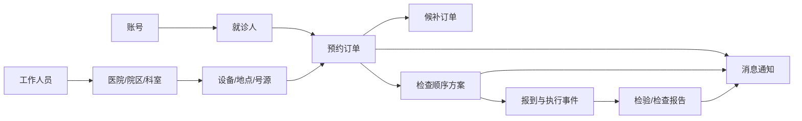

# 业务模块全景概览

> 文档状态：讨论草案
>
> 上位文档：`../01-overall-functional-framework.md`
>
> 说明：本文件从实际产品流程发散业务模块，不代表所有模块都进入首版，也不代表每个模块都要拆成微服务。

## 1. 产品业务全景

Hospital 不应只有“检查排序算法”和几个查询页面。站在患者视角，一条较完整的服务链路可能是：

```text
注册登录
  -> 建立就诊人
  -> 选择医院/院区/科室/检查项目
  -> 提交预约或候补
  -> 获得检查顺序与准备提醒
  -> 到院报到、候检和完成检查
  -> 接收报告与消息
  -> 管理历史记录和后续事项
```

对应地，医院工作人员需要管理组织、人员、项目、号源、预约订单、检查规则、报告和异常情况。

## 2. 患者端业务模块

### 2.1 账号与个人中心

负责微信登录、账号状态、联系方式、隐私授权、账号设置和注销申请。账号代表当前操作人，不一定等于实际就诊人。

### 2.2 就诊人管理

患者可以维护本人以及被授权管理的家属就诊人。该模块不是普通联系人列表，需要考虑：

- 就诊人基本信息；
- 与当前账号的关系；
- 医院就诊卡或院内患者标识绑定；
- 默认就诊人；
- 重复就诊人合并或提示；
- 未成年人、老人等代办关系；
- 解除绑定和授权失效；
- 敏感信息展示与脱敏。

预约、报告和检查方案都必须明确属于哪个就诊人。

### 2.3 医院、院区与科室服务

为患者展示可提供服务的医院、院区、科室、检查地点和服务说明。未来如果支持多医院，需要处理不同机构的项目目录、规则和可预约资源差异。

### 2.4 检查项目与服务项目

患者可以浏览或选择具体检查项目，系统需要处理项目名称、别名、部位、方式、适用机构、准备说明和启停状态。

如果项目来源于医生开单，还需要区分“已开立项目”和“患者自行选择的演示项目”，不能将两者混为一谈。

### 2.5 预约申请

如果产品进入真实预约场景，该模块负责：

- 选择就诊人；
- 选择医院、院区、科室或检查项目；
- 选择日期、时间段和可用资源；
- 提交预约；
- 防止重复预约；
- 接收预约成功、待确认或失败结果；
- 处理必要的确认、支付或材料要求。

预约结果应形成具有明确状态的预约订单，而不是只保存一个查询结果。

### 2.6 我的预约

集中管理当前账号下各就诊人的预约业务，包括：

- 待确认、已预约、待就诊、已完成、已取消和已失约等状态；
- 预约详情和准备事项；
- 改签、取消和重新预约；
- 到院时间、地点和导航信息；
- 与检查顺序方案的关联；
- 取消规则、截止时间和可能的费用处理；
- 历史预约和异常订单。

“我的预约”不是单纯列表，而是预约订单整个生命周期的患者入口。

### 2.7 候补订单

当目标时段没有可用资源时，患者可以申请候补。该模块需要处理：

- 候补目标和可接受时间范围；
- 候补优先规则；
- 资源释放后的通知和确认时限；
- 自动转预约或人工确认；
- 候补取消、过期和失败；
- 同一就诊人的重复候补限制。

候补涉及资源竞争和通知时效，应与普通预约订单区分。

### 2.8 检查顺序与行程方案

这是项目目前最有特色的核心模块。它根据某个就诊人的多项检查、规则和当前状态生成顺序建议，并与实际预约时间、地点和完成状态衔接。

患者可以查看：

- 推荐顺序；
- 每一步的原因；
- 检查前准备事项；
- 冲突和需要确认的问题；
- 已完成和待完成项目；
- 状态变化后的重新规划结果。

如果尚未接入真实号源，该模块仍可独立提供“检查流程建议”。

### 2.9 到院、报到与候检

真实落地时可能需要：

- 预约签到或报到；
- 到院状态；
- 候检队列和叫号信息；
- 迟到、过号和重新排队；
- 检查地点变更；
- 检查完成或未完成反馈。

这些状态会影响剩余检查的动态重排。

### 2.10 检验与检查报告

患者可以在报告正式发布后查看本人或已授权就诊人的报告。该模块需要考虑：

- 检验报告、影像检查报告等不同报告类型；
- 报告与就诊人、预约、检查项目的关联；
- 报告生成中、已发布、已更正和已撤回等状态；
- 医院系统同步和失败重试；
- 查看、下载、分享和打印权限；
- 敏感报告的二次验证和访问审计；
- 报告更正后的版本提示；
- 不提供未经授权的医学解释或诊断结论。

报告查询只有在能够可靠匹配患者身份、医院数据和发布状态后才能开放，不能仅凭姓名或手机号检索。

### 2.11 消息中心

统一承接预约结果、候补变化、检查准备、到院提醒、计划重排、报告发布和系统通知。需要记录消息类型、接收人、已读状态、跳转业务对象和发送渠道。

### 2.12 我的关注

患者可以关注医院、科室、检查服务或健康内容。关注行为可用于快捷入口和信息订阅，但不能擅自推断疾病或形成不必要的敏感画像。

### 2.13 支付、退款与票据

如果预约涉及费用，则需要订单支付、支付结果确认、退款、对账和电子票据。未确定收费模式前，只保留业务边界，不提前实现支付。

### 2.14 客服、反馈与投诉

支持预约异常、候补问题、报告未同步、账号或就诊人绑定问题的反馈。工单应关联具体业务对象并记录处理状态，避免只提供一个无法追踪的留言框。

### 2.15 设置与隐私

包含消息偏好、缓存清理、客服入口、用户协议、隐私政策、授权记录、账号注销和个人数据相关申请。

## 3. 医院工作人员端业务模块

### 3.1 机构与科室管理

管理医院、院区、科室、检查地点及其服务范围，为人员权限、检查项目、号源和报告归属提供基础。

### 3.2 工作人员与岗位

管理管理员、科室人员、检查人员、规则维护人员、客服和审计人员，并设置其所属机构、科室、岗位和可管理范围。

### 3.3 检查项目目录

维护不同医院和科室能够提供的检查项目、别名、部位、方式、说明、状态和外部系统编码。

### 3.4 排班、资源与号源

管理日期、时间段、设备、地点、容量、停诊和临时调整，为真实预约提供可用资源。

### 3.5 预约订单管理

处理预约确认、改签、取消、失约、异常订单、人工补录和患者咨询，并保留每次状态变化。

### 3.6 候补管理

管理候补规则、排序、资源释放后的转预约流程、确认超时和异常处理。

### 3.7 报到与执行管理

处理患者签到、候检、叫号、过号、检查开始、完成、取消和异常中止，并将关键事件反馈给检查顺序规划。

### 3.8 检查规则与知识管理

管理检查准备、条件、冲突、先后关系和规则来源，完成录入、审核、发布、停用和版本追溯。

### 3.9 报告接入与发布管理

接收或录入报告，处理患者匹配、报告状态、更正、撤回、同步失败和权限控制。系统是否自行生成报告不在当前范围内。

### 3.10 消息与模板管理

管理不同业务事件对应的站内消息、微信订阅消息或短信模板，以及发送失败和补发。

### 3.11 客服与异常工单

集中处理患者反馈、预约异常、候补争议、报告缺失、身份绑定和数据更正问题，并形成可追踪的处理流程。

### 3.12 审计与业务风险

记录规则发布、报告访问、权限变更、订单人工修改和敏感数据操作，并支持风险复核。

## 4. 平台支撑与外部集成模块

### 4.1 患者身份匹配

解决微信账号、平台用户、就诊人和医院患者主索引之间的映射，防止预约或报告关联到错误人员。

### 4.2 医院系统连接器

分别适配医院的预约、患者、检查项目、执行状态和报告接口。外部系统格式在连接器中转换，核心业务不直接依赖某一家医院的字段。

### 4.3 业务事件与任务中心

承接报告同步、消息发送、候补转预约、规则投影和失败重试等异步任务。它是后台业务处理能力，不是患者可见的普通查询模块。

### 4.4 运营分析

关注预约成功率、取消率、候补转化率、检查完成率、排序成功率、无解组合、报告同步时效和消息触达情况。

## 5. 主要业务对象之间的关系



## 6. 建议的分阶段范围

### 阶段一：验证核心价值

- 账号和就诊人；
- 检查项目目录；
- 检查规则管理；
- 检查顺序方案；
- 方案历史和消息提醒；
- 最小管理后台。

这一阶段可以不接真实医院号源和报告系统。

### 阶段二：形成预约产品

- 医院、院区和科室；
- 排班、资源和号源；
- 预约订单；
- 我的预约；
- 候补订单；
- 改签、取消和到院提醒；
- 工作人员订单管理。

### 阶段三：连接检查执行和结果

- 到院、报到和候检；
- 检查执行状态；
- 动态重排；
- 检验与检查报告；
- 报告发布消息；
- 客服和异常工单。

### 阶段四：医院级扩展

- 多医院和多组织；
- 医院系统连接器；
- 支付、退款和票据；
- 运营分析；
- 更复杂的人员和数据权限。

## 7. 后续需要讨论的问题

1. 产品首期是否真的拥有医院号源，还是只做检查顺序建议；
2. 就诊人信息来自患者填写还是医院系统；
3. 是否支持一个账号管理家属；
4. 预约对象是检查项目、科室、医生还是设备时段；
5. 候补是自动转预约还是需要患者确认；
6. 是否处理支付、退款和票据；
7. 报告由哪一个医院系统提供，患者身份如何可靠匹配；
8. 检验报告和影像报告是否采用相同展示与权限规则；
9. 哪些消息必须发送，哪些由用户选择订阅；
10. 医院工作人员需要哪些工作台和异常处理流程；
11. 第一家目标医院或演示场景能够提供哪些真实数据和接口。

这些问题确认后，再把模块拆成详细业务文档，并决定相应的数据模型、接口和服务边界。
